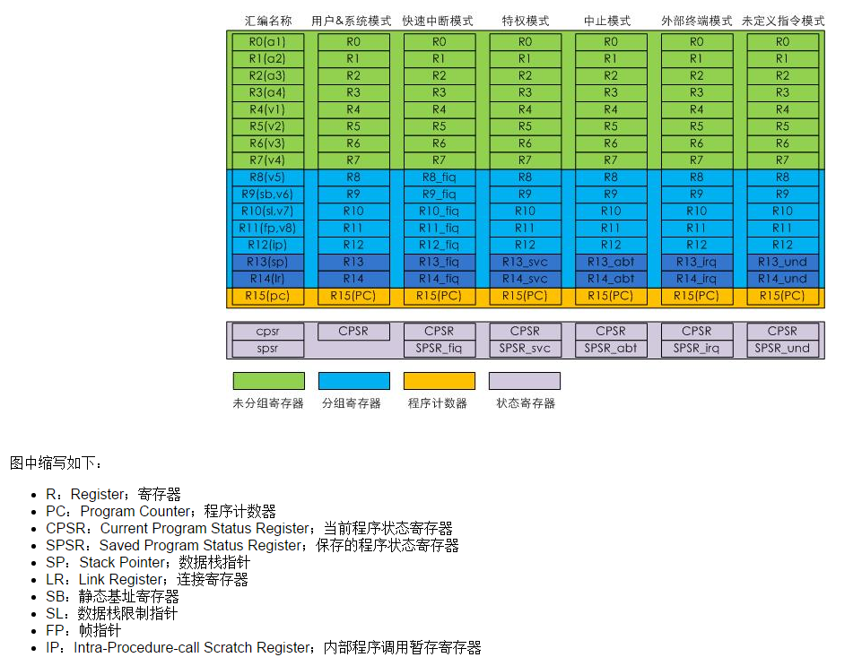
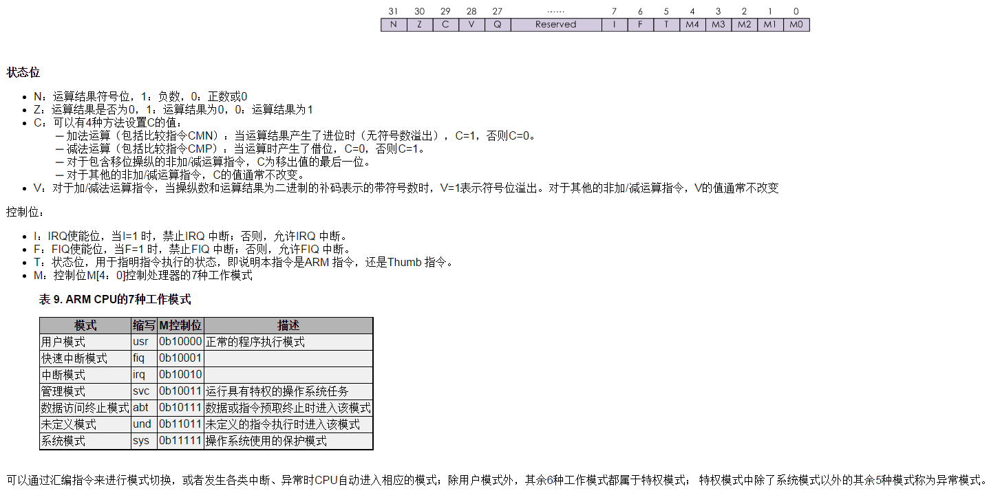
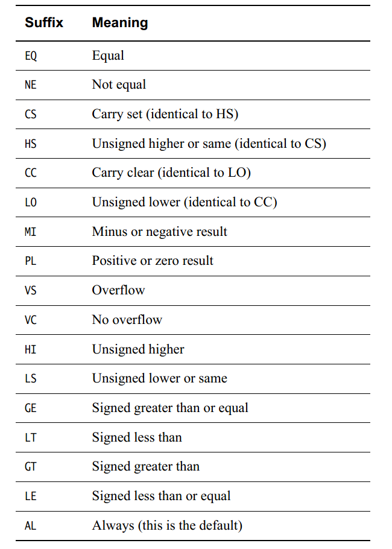

#根据汇编定位Android/iOS中的崩溃-汇编篇
### 2.1 主要寄存器
ARM主要有15个32位寄存器：

上面一排是其标准名称，下面一排是别称。这里我们比较熟悉的（主要是指X86背景）的就有IP/PC寄存器，其意义也是一样的。
这些通用寄存器在任何地方都可以见，可以用来作为一般存储位置使用，但是其中和X86类似的几个寄存器一般有固定意义：

* R12/IP  内部程序调用暂存寄存器
* R13/SP  数据栈寄存器，存放了当前栈顶的指针
* R14/LR  连接寄存器，存放了调用者的返回地址，也就是上一级函数的返回位置
* R15/PC  程序寄存器，存放了当前执行指令位置

除此之外还有个CSPR状态寄存器，记录了当前的状态，如是否发生溢出。

这里只是简单的介绍下在ARM汇编中常见到的寄存器。ARM汇编还分成各种模式，以及指令集的不同（Thumb/armv5te/ARM7TDMI...）,详细内容可以参考国内的书籍《汇编语言程序设计――基于ARM体系结构（第2版）》以及官方手册《ARM Compiler toolchain  Assembler Reference》，这里贴一个网上总结的图：

除了上面介绍的几个被特殊使用的寄存器外。 r0,r1,r2,r3,在调用函数时还有个特殊的作用：他们分别依次用来存放函数调用的参数。如果函数的参数多于4个，则多余参数存放在堆栈当中，即sp,sp+4,sp+8,…依次类推。返回时，返回值保存在R0中，如：

    int add(int a ,int b );
   
调用时，a存入r0中，b存入r1中，返回时，返回值存入r0中。

### 2.2 经典寻址方式

对数据的操作的操作就只有两个地方：寄存器和内存。那么取哪个寄存器/内存位置的数据，存放到哪里？这里ARM定义了一套寻址的规则，用来确定到底操作哪里的数据。

名称|示例代码|代码解释
---|---|-------
寄存器直接寻址| MOV R0, R1 | 将R1寄存器中的数存入到R0中
直接寻址|LDR R0, #0x0088 | 将内存地址0x0088中的数载入到内存中
立即数寻址|MOV R0, #15 | 将15放入寄存器R0中
寄存器间接寻址|LDR R0, [R1] | 将寄存器R1中的数表示的内存地址所指向的值加载进R0寄存器
寄存器带有偏移的间接寻址 | LDR R0, [R1, #4] | 将寄存器R1里的值加上4之后得到的地值表示的字为单位所指向内存值加载进R0寄存器
pre-index 寄存器带有偏移的间接寻址|LDR R0, [R1, #4]! | 将寄存器R1里的值加上4之后得到的地值表示的字为单位所指向内存值加载进R0寄存器，同时将R1寄存器中的值增加4
post-index 寄存器间接寻址|LDR R0, [R1], #4 | 将寄存器R1里的值表示的字为单位所指向内存值加载进R0寄存器，同时将R1寄存器中的值增加4

#### 寄存器间接寻址
所谓间接寻址就是先要从某个位置（寄存器）中取得一个地址，然后再到这个地址对应的内存位置取数据。
就像C中的“*”间接引用一样。所以看到这中代码，一般可以想到对应到C/CPP中有解引用的操作如

    pointer->name;
    (*pointer).name;
    
这里再举两个例子：
    
    LDR R0, [R1] ; 将寄存器R1中数值表示的字为单位的内存地址中数加载R0寄存器中
    STR	R2, [R3] ; 将R2寄存器中的数存入到R3寄存器中数值表示的字单位的内存中

#### 寄存器带有偏移的间接寻址

`间接`表示要先去一个地方取得一个地址，`偏移`是说这个取地址的地方是相对于某个位置的偏移后的地方。与上面的却别就在于，先取得寄存器中存放的数，然后以这个数位
基础再增加一个偏移量，表示目的操作内存的地址。可以联想到C/CPP中对指针做操作后再解引用，如：
    
    int i = (pointer + 2)->id;
    int j = (*(pointer + 2)).id;

再看两个例子：

    LDR R0, [R1, #20]	; 将寄存器R1里的值加上20之后得到的地值表示的字为单位所指向内存值加载进R0寄存器
    STR R0, [R1, #20]	; 将寄存器R1中的值存入寄存器R1里的值加上20之后得到的地值表示的字为单位所指向内存

#### pre-index 寄存器带有偏移的间接寻址
寄存器间接寻址我们上面解释清楚了，那么这里的pre-index表示什么呢?在C/CPP中有自增操作符，其写在变量前面和后面的效果是不一样的。pre-index就相当于“++i”，
先计算偏移后的地址。

    LDR R0, [R1, #20]!	; 将寄存器R1里的值加上20之后得到的地值表示的字为单位所指向内存值加载进R0寄存器,同时将R1寄存器中的数加20
    STR R0, [R1, #20]!	; 将寄存器R1中的值存入寄存器R1里的值加上20之后得到的地值表示的字为单位所指向内存,同时将R1寄存器中的数加20
    

#### post-index 寄存器间接寻址
C/CPP中的自增运算符还有种写法“i++”，此时先访问i后对i做自增运算。汇编中也是如此顺序进行计算：

    LDR R0, [R1], #20	; 将寄存器R1里的值表示的字为单位所指向内存值加载进R0寄存器,同时将R1寄存器中的数加20
    STR R0, [R1], #20	; 将寄存器R1中的值表示的字为单位所指向内存,同时将R1寄存器中的数加20
    

###2.3 经典指令

ARM汇编那么多指令，还分ARMv6/Thumb等种类，那么多指令如何记忆呢？这里我反汇编Android21上的libc.so发现有4885条指令。然后取得其中汇编指令抛去__开头的辅助指令，发现：

指令 |  使用次数 
---|---
STR| 965 
MOV| 965
LDMFD| 965 
ADD| 965 
AREA| 2 

这里发现指令非常少，可能libc中的逻辑比较少，主要是对系统辅助指令的使用。因此我们又拿了一个实际的c++项目的so来测试，其中总共有92669条指令，取TOP20发现：

指令 | 使用次数
---|---
LDR| 20878
MOV| 13454
ADD| 10032
STR| 9882
CMP| 6720
MOVS| 6008
ADDS| 1891
LDMFD| 1788
SUB| 1707
STMFD| 1528
STRB| 1357
LDRB| 1207
SUBS| 632
MOVNE| 607
MOVEQ| 528
LDMIA| 522
STMIA| 487
RSB| 443
ORR| 393
AND| 358

对照手册我们依次列下这些最常用指令的作用。

#### 2.3.1 拷贝复制
程序逻辑中最常用的拷贝复制操作，在汇编中有个对应的指令来表示：

    MOV Rd, Rn ; 将Rn寄存器中的数复制到Rd中
    
这里MOV操作是将逗号后面的寄存器中的数据或者立即数复制到逗号前面寄存器中，上面的例子中是复制寄存器，还可以是16位的立即数。当然这个是最简单的表达方式。在手册中的定义是：

    MOV{S}{cond} Rd, Operand2 
    MOV{cond} Rd, # imm16
   
其变种MOVS会在操作完之后更新结果的条件标识位“ condition code flags ”也就是CPSR寄存器。
这里附一张网上牛人总结的CPSR标识位的总结：

除此之外，还可以带有条件如“MOVEQ”、“MOVNE”
这里EQ/NE就是条件符。表示：当CPSR标识寄存器中的Z为置位（EQ判断为1）的时候才去执行MOV操作。常用的就有EQ/NE，这里附一张条件符号表：

#### 2.3.2 数据运算

##### 加法运算：ADD/ADDS
加法操作是将寄存器或者立即数的值进行相加。
    ADD  Rd, Rn, #12  ; Rn寄存器中的值和立即数12做加法后，将结果存入到Rd寄存器中。
    
其在手册中的定义是：

    ADD{S}{cond} { Rd},  Rn, Operand2
    ADD{cond} { Rd},  Rn, # imm12               ; Thumb, 32-bit encoding only
    
其变种ADDS在完成上面的计算的同时还会去更新CSPR状态寄存器中的结果。

##### 减法运算：SUB / RSB
减法操作是将寄存器或者立即数的值进行减法。
    SUB Rd,Rn, #12  ; 用Rn寄存器中的值减去立即数12后，将结果存入Rd寄存器中。
    RSB Rd,Rn, #12  ; 用立即数12减去寄存器Rn中值，将结果存入Rd寄存器中
    
其在手册中定义是：
    SUB{S}{cond} { Rd},  Rn, Operand2
    SUB{cond} { Rd},  Rn, # imm12               ; Thumb, 32-bit encoding only
    
    RSB{S}{cond} { Rd},  Rn, Operand2
   
均有一个带修改结果符号的命令版本SUBS/RSBS以及带条件的版本。二者的一个比较大的却别在于，前者是用前面的寄存器减去后面的；后者是用后面的去减前面的寄存器里面的值。
        
 
##### 比较运行：CMP/CNN
比较运算符将寄存器中的内容与其他值进行比较，该运行不同于加减，其没有将结果存入某个寄存器，而是通过修改结果的条件标识位来表示结果。
    
    CMP  Rn, Rt ; 比较寄存器Rn和Rt中的值

其在手册中的定义为：    
    CMP{cond} Rn, Operand2
    CMN{cond} Rn, Operand2
    
通过检查CPSR的标识位来得到结果。
    

##### 求或：ORR
“或”命令计算寄存器中的内容与其他值进行二进制或运算后的结果。

    ORR  Rd, Rn, #12  ; 计算Rn寄存器中内容或上12后的结果，并将结果存入Rd中
    
其在手册中定位为：

    ORR{S}{cond} Rd, Rn, Operand2
    
一样有个影响符号位的版本：ORRS。已经相应的配合if...else的条件版本如ORREQ/ORRNE

##### 求余：AND
“与”命令计算寄存器中的内容与其他值进行二进制与运算后的结果。
    
    AND Rd, Rn,#12 ; 计算Rn寄存器中内容与上12后的结果，并将结果存入Rd中
    
其在手册中定位为：

    AND{S}{cond} Rd, Rn, Operand2
    
一样有个影响符号位的版本：ANDS。已经相应的配合if...else的条件版本如ANDEQ/ANDNE

#### 2.3.3 寄存器和内存数据交换
数据运行是针对寄存器的，但是我们的数据和指令通常又是存在内存的。要进行运算就首先需要将数据从内存加载至寄存器，使用指令：

    LDR Rt,[Rn]  ;将逗号后面Rn寻址得到的内存里面的值加载进前面的Rt寄存器中。
    
L的含义仍然是LOAD，即是Load from memory into register。
这里为了简明起见，采用了一个寄存器间接寻址作为例子。具体还可以加上修饰符表示操作的单位如8bit/16bit已经操作条件。具体可以参见手册。

对应的，如果将数据从寄存器中存入内存，则使用

    STR Rt, [Rn]   ;这里将逗号前面的寄存器Rt里面的值存入到后面的Rn寄存器寻址后得到的内存里面。
    
寻址方式在上面已经介绍。

可以看一些例子：
    LDR R0, [R1] ; 将寄存器R1中数值表示的字为单位的内存地址中数加载R0寄存器中
    STR	R2, [R3] ; 将R2寄存器中的数存入到R3寄存器中数值表示的字单位的内存中   
    
    LDR R0, [R1, #20]	; 将寄存器R1里的值加上20之后得到的地值表示的字为单位所指向内存值加载进R0寄存器
    STR R0, [R1, #20]	; 将寄存器R1中的值存入寄存器R1里的值加上20之后得到的地值表示的字为单位所指向内存 
    
    LDR R0, [R1, #20]!	; 将寄存器R1里的值加上20之后得到的地值表示的字为单位所指向内存值加载进R0寄存器,同时将R1寄存器中的数加20
    STR R0, [R1, #20]!	; 将寄存器R1中的值存入寄存器R1里的值加上20之后得到的地值表示的字为单位所指向内存,同时将R1寄存器中的数加20
    

除了上面最简单的对一个寄存器进行“加载/存储”操作外，还可以对一堆寄存器进行操作。
对应的使用指令LDM和STM。这二者的理解较为复杂 LDM：L的含义仍然是LOAD。这个指令运行的方向和LDR是不一样的，是从左到右运行的。该指令是将内存中堆栈内的数据，批量的赋值给寄存器，即是出栈操作。
一个常见的场景就是其中堆栈指针一般对应于SP，也就是寄存器R13，注意这里写SP实际用到的是R13中的内存地址，相当于[R13]，如：

    LDMFD     SP ,   {R0, R1, R2} ;把sp指向的3个连续地址段（应该是3*4=12字节（因为为r0,r1,r2都是32位））中的数据拷贝到r0,r1,r2这3个寄存器中去
					
STM与LDM是配对使用的，其指令格式上也相似，即区别于STR，是将堆栈指针写在左边，而把寄存器组写在右边，如：

    STMFD      SP,   {R0, R1,R2} ; 把R0,R1,R2保存到堆栈（sp指向的地址）中。
    
可以看的出来，上面的组合即可以构成函数调用的出入栈动作了。

###2.4.4 Bring it to all

上面介绍只是从最常用的一些指令中将他们进行分类并介绍了这些指令基本的作用。并没有对每个命令做详细介绍，详细介绍可以参考手册中的说明，
后续也会对特殊的命令做专题介绍。比如LDM。

