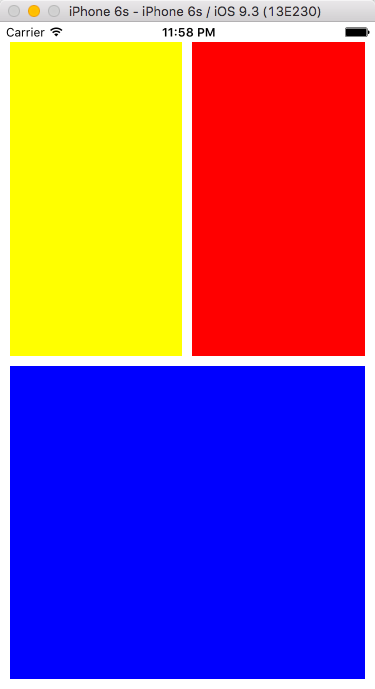

# 活用Masonry
> Masonry is still actively maintained, we are committed to fixing bugs and merging good quality PRs from the wider community. However if you're using Swift in your project, we recommend using SnapKit as it provides better type safety with a simpler API.
-- https://github.com/SnapKit/Masonry

首先来段免责声明，Masonry现在虽然任在维护中，但是官方现在的精力在其Swift版本的[SnapKit](https://github.com/SnapKit/SnapKit)。

Masonry提供了一种链式（chainable）描述AutoLayout的DSL(Domain Specific Language)。何为链式呢？比如

	xiaoming.goToScholl().and.playBasketball()

类似这样，用“.”将各个语义连接起来达成一项功能的时候，这样使得表达式（DSL）更接近自然语言。上面的语句字面意思是不是就是"小明去学校打篮球去了"，会几个英语单词的小学生基本都能读懂。如果真如Masonry自己描述的一样，他用这样一个“chainable”的DSL是否能够消除AutoLayout的复杂和冗余呢？

## 赶紧尝一口

Masonry支持CocoaPods安装（废话，这么Popular的项目怎么能不支持CocoaPods）。在Pod文件中加入

	pod 'Masonry'

然后执行：

	pod install
	
在代码中，只要包含“Masonry.h”头文件就可以了

	#import <Masonry/Masonry.h>

来看个例子效果，在我们写例子程序的时候，经常遇到几个按钮加个日志显示的场景，假设两个按钮在同一行，让后下面一个日志显示的TextView，这种的三角布局：

	
	@interface ViewController ()
	@property (nonatomic, strong) UIView *topLeft;
	@property (nonatomic, strong) UIView *topRight;
	@property (nonatomic, strong) UIView *bottom;
	@end
	
	@implementation ViewController
	
	- (void)viewDidLoad {
	    [super viewDidLoad];
	    // Do any additional setup after loading the view, typically from a nib.
	    _topLeft = [UIView new];
	    [_topLeft setBackgroundColor: [UIColor yellowColor]];
	    _topRight = [UIView new];
	    [_topRight setBackgroundColor:[UIColor redColor]];
	    _bottom = [UIView new];
	    [_bottom setBackgroundColor:[UIColor blueColor]];
	    [self.view addSubview:_topLeft];
	    [self.view addSubview:_topRight];
	    [self.view addSubview:_bottom];
	    
	    
	    // AutoLayout with Masonry
	    [_topLeft mas_makeConstraints:^(MASConstraintMaker *make) {
	        make.width.equalTo(_topRight.mas_width);
	        make.top.equalTo(self.view.mas_top).offset(20);
	        make.left.equalTo(self.view.mas_left).offset(10);
	        make.right.equalTo(_topRight.mas_left).offset(-10);
	        make.bottom.equalTo(_bottom.mas_top).offset(-10);
	    }];
	
	    [_topRight mas_makeConstraints:^(MASConstraintMaker *make) {
	        make.top.equalTo(self.view.mas_top).offset(20);
	        make.right.equalTo(self.view.mas_right).offset(-10);
	        make.bottom.equalTo(_bottom.mas_top).offset(-10);
	    }];
	    
	    [_bottom mas_makeConstraints:^(MASConstraintMaker *make) {
	        make.height.equalTo(_topLeft.mas_height);
	        make.left.equalTo(self.view.mas_left).offset(10);
	        make.right.equalTo(self.view.mas_right).offset(-10);
	        make.bottom.equalTo(self.view.mas_bottom).offset(-10);
	    }];
	    
	
	}

运行后效果如下：

## 使用Masonry进行布局
看上面的代码，会发现和以往的frame+center布局的不同的是，这里不在使用`initWithFrame`，然后多出来一个函数调用，有且只有这一个函数调用：

	- (NSArray *)mas_makeConstraints:(void(^)(MASConstraintMaker *make))block;
	
正常来说，基本情况下使用这个一个函数就够了。Masonry还提供了另外两个`- (NSArray *)mas_updateConstraints:(void(^)(MASConstraintMaker *make))block;`和`- (NSArray *)mas_remakeConstraints:(void(^)(MASConstraintMaker *make))block;` 描述布局DSL作为补充，三者的原理是一样的，只是不同函数用在不同的上下文，所以只要了解上面这个函数的时候，基本上就掌握了Masonry的DSL了。

*这里有个需要注意的点，`mas_makeConstraints`调用中影响的view必须是以及被`addSubview`，也就是必须有parentView *

先来看这个函数原型，就只有一个block参数，block内容会被及时的回调，所以这个函数其实也就是为了调用这个block而准备的，而block里面通过`MASConstraintMaker`作为载体来执行我们上面说的“链式”DSL，进行布局动作。所以可以认为上面的：

    [_topRight mas_makeConstraints:^(MASConstraintMaker *make) {
			//make.xxx.xxx().xxx()
    }];

是一个模板，填充里面make打头的DSL即可，这里make就可以认为是要布局的view的代理。对应的，如果要修改一个已经被布局的view的布局策略(只更新新的策略，原有未描述的策略保留)，则使用个`- (NSArray *)mas_updateConstraints:(void(^)(MASConstraintMaker *make))block;`一样的去填充“make”开头的DSL即可。或者完全重新开始布局 `- (NSArray *)mas_remakeConstraints:(void(^)(MASConstraintMaker *make))block;` ，先清除所有布局，然后再加上新布局条件。

了解了这个模板以后，再来看下模板里面变个内容：

	make.width.equalTo(_topRight.mas_width);		
基本格式是：

		make.attr.constrains
		
这里以"make"开头，然后指定其的一个属性（attr），然后再试这个属性的约束(constrains)。约束可能是多级的组合，比如`.equalTo(self.view.mas_top).offset(20)`的两级组合，显示找到父view的top位置，再向下（Y轴）移动20点。

## 布局中的属性

## 布局中的约束

## 总结
通过上面的实例程序，和AutoLayout的官方例子一比较也可以看得出Masonry的可读性更强，在Masonry的例子工程中演示的各种示例向我们展示了其基本能
满足大部分的布局需求，所以在布局的时候，还是比较推荐用Masonry试一下，如果产品真的有特殊的要求，再行替代也不迟，只是在demo阶段，Masonry是首要选择。

另外一个需要了解的是，当布局不成功的时候，首先请先不要怀疑Masonry，Masonry只是对AutoLayout的一个轻量封装，先想想AutoLayout的使用约束，是不是
本身的描述就有悖于AutoLayout的设计。这一点可能看文档还不够，需要多去实验才能逐步掌握，希望这边文章能够为你的实践迈出第一步。

## 参考
1. [Masonry](https://github.com/SnapKit/Masonry)
2. [Auto Layout Guide](https://developer.apple.com/library/watchos/documentation/UserExperience/Conceptual/AutolayoutPG/Introduction/Introduction.html)

