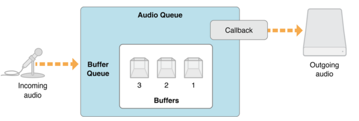
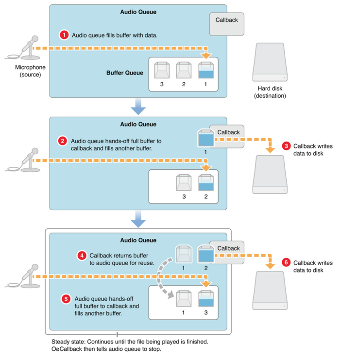

#iOS CoreAudio : AudioQueue简介

>> An audio queue is a software object you use for recording or playing audio in iOS 
												-- 《Audio Queue Services Programming Guide》  
Auido Queue是iOS上用来录音和播放的软件对象，也就是通过它我们就可以完成用iPhone硬件进行录音和播放的功能
了。其作用包括
* 操作iPhone 麦克风和扬声器硬件，进行录音和播放
* 管理过程中需要的内存
* 对音频数据进行压缩编码、解码解压缩
* 协调录音和播放的次序、时间、截断等

所以AudioQueue还是做了蛮多事情。这里我们看下AudioQueue在系统中的结构。

其位于AudioUnit之上，较为上层的接口。之前的[CoreAudio基本结构]()也介绍了，如果是播放网络流或者片段的内存音频数据，可以考虑用这里的AudioQueue.

##1. AuidoQueue
AudioQueue主要分成用于录制功能的InputQueue由`AudioQueueNewInput`生成和用于播放功能的OutputQueue由`AudioQueueNewOutput`	生成。每个Queue包含了用于缓存数据的AudioQueuBuffer队列，一个状态回调，以及描述音频数据格式的描述符。

这里为什么是Buffer队列呢？来看个图

对于录音的时候，当一个buffer被录音的数据填满了，就交给回调去处理，这个时候再来的数据就会放到后面的buffer中，当回调处理完后，在调用AudioQueueEnqueueBuffer将该buffer放回到队列中重复利用。所以一般这个队列的大小大于2即可，比如3个buffer。

从上面的图中我们还可以看到一个AudioQueue还包含了其对应的回调处理函数，在这个回调中需要进行一系列的AudioQueueEnqueueBuffer动作，从而使空闲出来的buffer再被循环利用。

除了使用`AudioQueueEnqueueBuffer`还可以使用`AudioQueueEnqueueBufferWithParameters`对Buffer内容进行一些设置。

##2. AudioQueueBuffer

用来缓存录音采集到的或者播放中的缓冲音频数据。其定义为:

	typedef struct AudioQueueBuffer {
	    const UInt32   mAudioDataBytesCapacity;  // Buffer最大存放内容数目
	    void *const    mAudioData;               // 具体的数据内容
	    UInt32         mAudioDataByteSize;       // 数据内容有效长度
	    void           *mUserData;               // 用户自定义数据，主要用于回调保存现场
	} AudioQueueBuffer;
	typedef AudioQueueBuffer *AudioQueueBufferRef;
	
通过调用`AudioQueueAllocateBuffer`创建一个AudioQueueBuffer。当使用完之后，使用`AudioQueueDispose`进行释放，注意这里AudioToolBox提供的AudioQueueService是一套C接口，和AVFoundation的Objecitve-C接口不一样，不能依赖ARC进行内存管理，所以在使用之后一定记得要调用这个Dispose接口释放资源，否则容易造成内存泄露问题。
	
##3. 录音的流程
使用AduioQueue的过程中，有几个数据是要全局保存的，因为是C接口，所以可以将其用struct组织起来，或者放到`{}`中作为成员。

	AudioFileID fd;
	AudioStreamBasicDescription  fmt;
	AudioQueueRef                aq;
	AudioQueueBufferRef          aqb[AQB_BUFFER_NUM];
	
若是读文件，需要一个文件句柄AudioFileID， 音频流的描述AudioStreamBasicDescription包括了采样率、声道数等属性以及AudioQueue的载体AudioQueueRef和一个Buffer数组AudioQueueBufferRef[]。还有些其他数据，在后面使用的时候再介绍，这里只要知道需要用户去管理一些上下文信息。

然后对于上面的BufferQueue要先调用`AudioQueueAllocateBuffer`分配相关空间（注意最后不用的时候要调用AudioQueueFreeBuffer释放空间），并将buffer调用`AudioQueueEnqueueBuffer`或者`AudioQueueEnqueueBufferWithParameters`放入到AudioQueue中去。

接着最主要的就是要根据需要实现回调函数:
	
	typedef void (*AudioQueueInputCallback)(
                                    void * __nullable               inUserData,
                                    AudioQueueRef                   inAQ,
                                    AudioQueueBufferRef             inBuffer,
                                    const AudioTimeStamp *          inStartTime,
                                    UInt32                          inNumberPacketDescriptions,
                                    const AudioStreamPacketDescription * __nullable inPacketDescs);
                             

从图中可以看到，在录制的过程中，当从麦克风中采集到足够多的数据后，存放到AudioQueueBufferRef中，当一个inBuffer被存满后，就会调用上面的回调，通知用户去处理数据。
在回调里面处理完inBuffer里面的数据后，在调用`AudioQueueEnqueueBuffer`或者`AudioQueueEnqueueBufferWithParameters`回收再利用。

实现完回调之后，通过`AudioQueueNewInput`创建InputBuffer。

之后就是用`AudioQueueStart`启动Queue开始录音，`AudioQueueStart`停止queue，`AudioQueuePause`暂停录音以及`AudioQueueDispose`回收资源。

##4. 播放的流程
对于播放，也是一样，需要准备一些上下文数据，

	AudioFileID fd;
	AudioStreamBasicDescription  fmt;
	AudioQueueRef                aq;
	AudioQueueBufferRef          aqb[AQB_BUFFER_NUM];
各个数据类型定义同上面。同样也是调用`AudioQueueAllocateBuffer`创建Buffer然后调用`AudioQueueEnqueueBuffer`或者`AudioQueueEnqueueBufferWithParameters`加入到AudioQueue中。

最重要的也是要实现一个回调函数：

	typedef void (*AudioQueueOutputCallback)(
                                    void * __nullable       inUserData,
                                    AudioQueueRef           inAQ,
                                    AudioQueueBufferRef     inBuffer);
                                    
参数会少一些，不过基本最主要的还是Queue inAQ和Buffer inBuffer。

看图中的流程，首先要准备好数据，放到buffer中，然后当系统可以播放的时候，就会去buffer queue中取buffer来用，用完后（播放完）就会调用上面的回调通知用户去继续装填音频数据到buffer中，在调用`AudioQueueEnqueueBuffer`或者`AudioQueueEnqueueBufferWithParameters`给系统需要时取用。

和录制一样，控制开始、暂停、停止以及回收资源的接口：`AudioQueueStart`，`AudioQueueStart`，`AudioQueuePause`以及`AudioQueueDispose`

##总结
这里只是对AudioQueueService的组成部分和使用过程进行了描述，还是比较抽象的。看完之后也不知道怎么时候，后面两篇文章依次介绍了如何使用这里介绍的流程进行录制和播放。
##参考文档
1. [Audio Queue Services Programming Guide](https://developer.apple.com/library/mac/documentation/MusicAudio/Conceptual/AudioQueueProgrammingGuide/AboutAudioQueues/AboutAudioQueues.html#//apple_ref/doc/uid/TP40005343-CH5-SW1)
2. [Core Audio Overview](https://developer.apple.com/library/mac/documentation/MusicAudio/Conceptual/CoreAudioOverview/Introduction/Introduction.html)