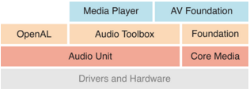

#iOS CoreAudio : AudioQueue简介

>> An audio queue is a software object you use for recording or playing audio in iOS 
												-- 《Audio Queue Services Programming Guide》  
Auido Queue是iOS上用来录音和播放的软件对象，也就是通过它我们就可以完成用iPhone硬件进行录音和播放的功能
了。其作用包括
* 操作iPhone 麦克风和扬声器硬件，进行录音和播放
* 管理过程中需要的内存
* 对音频数据进行压缩编码、解码解压缩
* 协调录音和播放的次序

多以AudioQueue还是做了蛮多事情。这里我们看下AudioQueue在系统中的结构。

其位于AudioUnit之上，较为上层的接口。之前的[CoreAudio基本结构]()也介绍了，如果是播放网络流或者片段的内存音频数据，可以考虑用这里的AudioQueue.

##1. AuidoQueue
AudioQueue主要分成用于录制功能的InputQueue由`AudioQueueNewInput`生成和用于播放功能的OutputQueue由`AudioQueueNewOutput`	生成。每个Queue包含了用于缓存数据的AudioQueuBuffer队列，一个状态回调，以及描述音频数据格式的描述符。

这里为什么是Buffer队列呢？来看个图

对于录音的时候，当一个buffer被录音的数据填满了，就交给回调去处理，这个时候再来的数据就会放到后面的buffer中，当回调处理完后，在调用AudioQueueEnqueueBuffer将该buffer放回到队列中重复利用。所以一般这个队列的大小大于2即可，比如3个buffer。

##2. AudioQueueBuffer

用来缓存录音采集到的或者播放中的缓冲音频数据。其定义为:

	typedef struct AudioQueueBuffer {
	    const UInt32   mAudioDataBytesCapacity;  // Buffer最大存放内容数目
	    void *const    mAudioData;               // 具体的数据内容
	    UInt32         mAudioDataByteSize;       // 数据内容有效长度
	    void           *mUserData;               // 用户自定义数据，主要用于回调保存现场
	} AudioQueueBuffer;
	typedef AudioQueueBuffer *AudioQueueBufferRef;

##总结

##参考文档
1. [Audio Queue Services Programming Guide](https://developer.apple.com/library/mac/documentation/MusicAudio/Conceptual/AudioQueueProgrammingGuide/AboutAudioQueues/AboutAudioQueues.html#//apple_ref/doc/uid/TP40005343-CH5-SW1)
2. [Core Audio Overview](https://developer.apple.com/library/mac/documentation/MusicAudio/Conceptual/CoreAudioOverview/Introduction/Introduction.html)