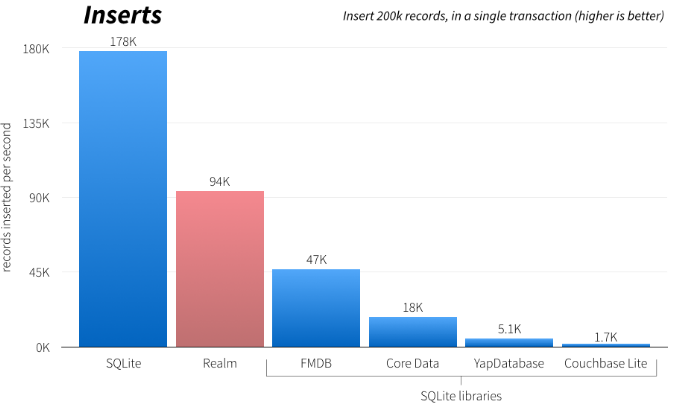

# 进阶Realm
在前面的篇章[《Realm的CRUD》](http://www.jianshu.com/p/8a9fb7a74ff1)介绍了怎么最简单的吧Realm给用起来，并通过一个Demo演示了CRUD的操作。除此之外Realm还提供了诸如消息通知、调试、数据加密等功能，我们一一来看。

## 0. 数据定义

## 1. 查询处理

## 2. JSON解析

## 3. 消息通知

## 4. 文件存储

## 5. 调试

## 6. 版本兼容

## 7. 数据加密

## 总结
Realm的消息通知、数据加密、JSON支持等特性让Realm直接区别于SQLite和CoreData。也为我们切换到Realm提供了理由支持。在性能上面根据[Realm的测试](https://realm.io/news/introducing-realm/)其高于SQLite两倍多，甩CoreData更不止一个数量级：

  

唯一没有经过验证的就是他的崩溃率了，在使用SQLite的过程中，崩溃还是比较常见的，不知道Realm这方面的表现如何，这个需要真实的App去验证，比如接入腾讯的Bugly来看。
## 参考
1. [Realm Objective-C](https://realm.io/docs/objc/latest/)
2. [Introducing Realm](https://realm.io/news/introducing-realm/)
3. [Realm API Reference ](https://realm.io/docs/objc/1.0.1/api/)
3. [Building an iOS Search Controller](https://realm.io/news/building-an-ios-search-controller-in-objective-c/)