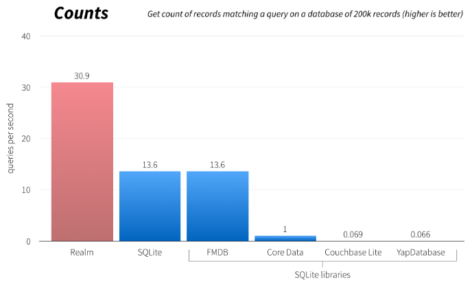
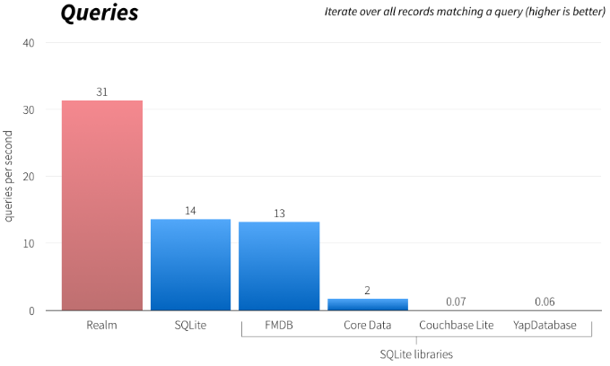

# 进阶Realm
在前面的篇章[《Realm的CRUD》](http://www.jianshu.com/p/8a9fb7a74ff1)介绍了怎么最简单的吧Realm给用起来，并通过一个Demo演示了CRUD的操作。除此之外Realm还提供了诸如消息通知、调试、数据加密等功能，我们一一来看。

## 0. 数据定义

### 成员结构
基本的数据结构定义很简单，就和普通的NSObject定义一样：

	@interface Dog : RLMObject
	@property NSString *name;
	@end
	
	@interface Master : RLMObject
	@property NSString *name;
	@end

不同的是，这里没有使用nonatomic, atomic, strong, copy, weak等修饰符，因为Realm自己会管理所欲Realm对象的存储行为，所以也就不需要用到系统的机制来协助了。

如果想表示两个数据结构之间是一对一关联关系,那么类似二维表表中存储另一个表的主键key一样，我们只要在成员中增加一个关联对象的引用就可以了,比如说每个Dog都有一个主人Master：

	@interface Dog : RLMObject
	@property NSString *name;
	@porperty Master *owner;
	@end
这样就可以了，并且在查询的时候还可以用 `dog.owner == tomMaster`这样直接比较对象的方式来过滤查询条件。

那如果要像之前的demo中表示一个Master有多条Dog怎么办呢?一般SQL里面我们会定义一个新的表来维护这个关系，而Realm提供了一些集合对象，比如RLMArray来表示这样的“一对多”的关系：

	RLM_ARRAY_TYPE(Dog) // Defines an RLMArray<Dog> type

	@interface Master : RLMObject
	@property NSString *name;
	@property RLMarry<Dog *><Dog> *dogs;
	@end
首先要用Realm的宏“RLM_ARRAY_TYPE“来定义“RLMArray<Dog>”这个类型，然后和上面一样，在成员中增加一个“RLMarry<Dog *><Dog> *”成员表示"Dog *"的数组，这个表达方式在前篇文字有述，就不再赘述了。这样在查询的时候，Realm不仅会帮我们去的Master表中的数据，同时还会去Dog表中查询归属这个Master的Dog并填充到这个数组中。

### 行为接口
除了用成员的方式来设置数据结构关系，Realm还为每个RLMObject定义了一些接口来约束其默认表现。

#### linkingObjectsProperties
#### indexedProperties
#### defaultPropertyValues
#### primaryKey
#### ignoredProperties
#### requiredProperties

## 1. 查询处理

## 2. JSON解析

## 3. 消息通知

## 4. 文件存储

## 5. 调试

## 6. 版本兼容

## 7. 数据加密

## 总结
Realm的消息通知、数据加密、JSON支持等特性让Realm直接区别于SQLite和CoreData。也为我们切换到Realm提供了理由支持。在性能上面根据[Realm的测试](https://realm.io/news/introducing-realm/)其高于SQLite两倍多，甩CoreData更不止一个数量级：

  

唯一没有经过验证的就是他的崩溃率了，在使用SQLite的过程中，崩溃还是比较常见的，不知道Realm这方面的表现如何，这个需要真实的App去验证，比如接入腾讯的Bugly来看。
## 参考
1. [Realm Objective-C](https://realm.io/docs/objc/latest/)
2. [Introducing Realm](https://realm.io/news/introducing-realm/)
3. [Realm API Reference ](https://realm.io/docs/objc/1.0.1/api/)
3. [Building an iOS Search Controller](https://realm.io/news/building-an-ios-search-controller-in-objective-c/)