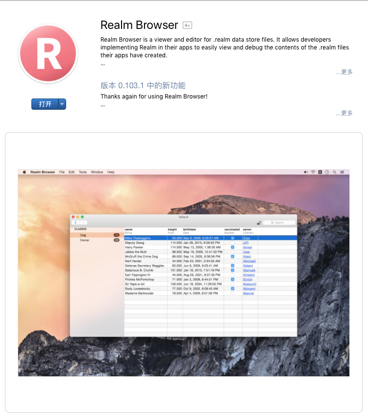
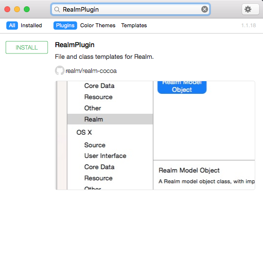
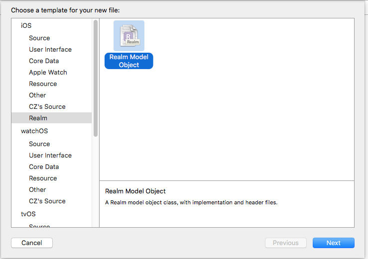
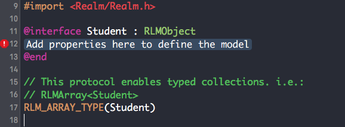
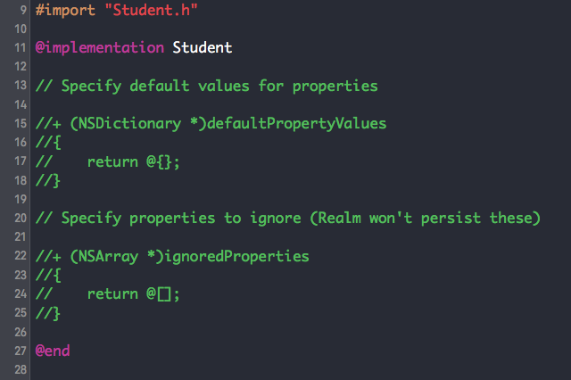
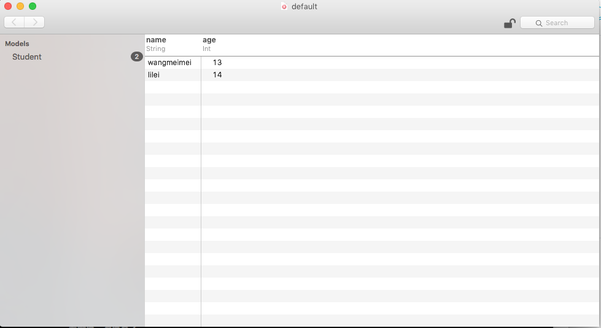
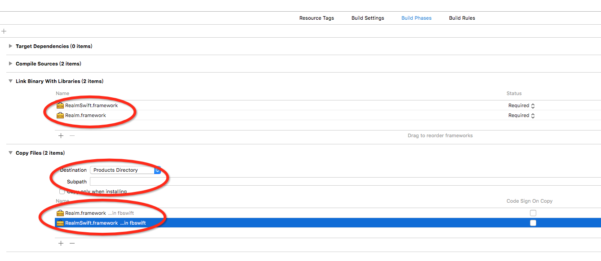

# 尝鲜Realm
> 25 May 2016 : 13,949 Commits and 6,148 Closed Issues Later: Thank You for Helping Realm Reach 1.0

从2014年6月宣布“the first mobile-first database.” 开始，到2016年5月，历经2年淬炼的Realm终于发布了1.0版本，根据Realm官方的说法，这两年他们和社区一共做了13，949次提交、关闭了6，148个Issues，收获了12,000 个github star,并被上十亿（billion）的App用户启动，被数十万活跃的开发人员使用，而且这其中不乏超级大公司如Twitter、Alibaba、eBay之流。

所以，这么漂亮的数据，你怎么能不去尝试下呢？

## 0. Realm 解决什么问题
在生产环境的App的制作过程中，持久化数据是必不可少的，比如缓存用户的个人信息、缓存用户的联系人信息等。而解决方法最常见的就是使用RDB（关系型数据库）比如SQLite，或者是使用Apple提供的数据持久话方案：CoreData。现在Realm提供了一个新的解决方案：
没有SQLite那赤裸的SQL语句
没有CoreData的复杂
却能提供上面二者所能提供的功能，并且速度更快，操作更简洁。

Realm是一个专注于移动平台、提供多种操作接口（Java/Objective-C/Swift/JS-reactivenative/C#-xamarin）的*免费*的数据库产品。使用Realm就再也不用写SQL语句了，也不用做复杂的CoreData配置了。 先来看个官方的例子(OC的例子，其他语言可以在[官网](https://realm.io/)找到)：

	@interface Dog : RLMObject
	@property NSString *name;
	@property NSInteger age;
	@end
	@implementation Dog
	@end
	
	Dog *dog = [Dog new];
	dog.name = @"Rex";
	dog.age = 1;
	
	RLMRealm *realm = [RLMRealm defaultRealm];
	[realm transactionWithBlock:^{
	    [realm addObject:dog];
	}];
	
	RLMResults<Dog *> *allDogs = [Dog allObjects];
	RLMResults<Dog *> *pups = [allDogs objectsWhere:@"age < 2"];
	
这里定义了一个dog对象，并将其age设置为1，然后将其存放在被Realm的Dog 实例中，可以认为他就是物理存储，然后用查询语句"age<2"搜索出所有Dog对象中 age小于2的对象。

## 1. 安装Realm
如果目标语言是用的OC的话，那么咱们首选肯定是CocoaPods啦，在Podfile中添加：

	target 'YourApp' do
		pod 'Realm'
	end
	
再执行 `pod install` 等待安装完成后打开目录下的.xcworkspace文件就可以了。

当然也可以直接下载Realm的framework来集成，对于这种提供framework我更倾向于用，这样目录更clean而且第三方插件的版本也很好维护，最新的OC版本framework可在在官网下载[realm-objc-1.0.1](https://static.realm.io/downloads/objc/realm-objc-1.0.1.zip),然后直接拖到自己的Xcode工程里面就可以了。

在需要用到的文件中：

	#import <Realm/Realm.h>

不报错就表示设置成功了，后面就可以使用Realm的接口了。

如果是用的Swift版本除了Realm.framework还需要RealmSwift.framework ，也可以用上面的CocoaPods：

	target 'YourApp' do
		 use_frameworks!
		 pod 'RealmSwift'
	end

一样的执行 `pod install`等待安装完成后打开目录下的.xcworkspace文件就可以了。

当然同样的理由，我同时也推荐直接使用framework的方式[realm-swift-1.0.1](https://github.com/realm/realm-cocoa/releases/download/v1.0.1/realm-swift-1.0.1.zip)，当然同时也要把Realm.framework拖入到工程中。

在需要用到的文件中：
	
	#import Realm
	
不报错就表示可以正常使用Real的Swift接口了。

## 2. Realm提供的快刀
Realm为了体现他的友好和简介，除了提供了SDK以外，还为开发者提供了一个可以浏览数据内容的App（MacOS），想想PHPMyAdmin或者MySQLWorkbench的可视化，极大的方便了开发调试查看。可以在AppStore上下载这个[Realm Browser](https://itunes.apple.com/app/realm-browser/id1007457278):
	

下载安装成功后，点击打开找到要浏览的.realm 的db文件就可以了。或者直接双击打开.realm文件，会默认用RealmBrowser打开。

除了可以查看数据库文件的工具外，Realm还为开发者提供了一个Xcode插件，其提供了一个创建Realm对象文件的模板（可以根据当前工程是Objective-C还是Swift自动创建对应的文件模板）。方便开发者修改。

插件的安装可以使用[Alcatraz](http://alcatraz.io/)，直接搜索"Realm Plugin"就可以了：

安装好之后，当新建文件的时候，就会有个"realm"的选项：

点击后会生成文件模板：

 

## 3. 来个例子
现在来个例子提提神，这里创建了一个MacOS下的Objective-C的命令行工具工程，用上面的RealmPlugin插件新建了两个文件“Studen.h”和"Student.m"。然后在main.m中填写主要逻辑：

	@interface Student : RLMObject
	@property NSString *name;
	@property NSInteger age;  
	@end

Realm存储对象Student包含两个成员，表示名字的name和年龄的age。

	NSString *jsonData = @"[{\"name\":\"wangmeimei\",\"age\":13},{\"name\":\"lilei\",\"age\":14}]";
	
	void demo4realm() {
	    NSError *error;
	    NSMutableArray *students = [NSJSONSerialization JSONObjectWithData:[jsonData dataUsingEncoding:NSUTF8StringEncoding] options:NSJSONReadingMutableContainers error:&error];
	    if (nil != error) {
	        NSLog(@"Parse JSON Error %@", error);
	        return ;
	    }
	    RLMRealm *realmMgr = [RLMRealm defaultRealm];
	    NSLog(@"db file is %@",realmMgr.configuration.fileURL);
	    for (NSDictionary *s in students) {
	        Student *student = [Student new];
	        student.age = [[s valueForKey:@"age"] intValue];
	        student.name = [s valueForKey:@"name"];
	        [realmMgr transactionWithBlock:^{
	            [realmMgr addObject:student];
	        }];
	    }
	    
	    RLMResults<Student *> *allStudents = [Student allObjects];
	    NSLog(@"All students' count %lu", (unsigned long)[allStudents count]);
	    RLMResults<Student *> *fs = [allStudents objectsWhere:@"age > 13"];
	
	    for (int i=0; i<[fs count]; i++) {
	        Student *s = [fs objectAtIndex:i];
	        NSLog(@"Name %@ age is %ld", s.name , (long)s.age);
	    }
	
	}
	
	int main(int argc, const char * argv[]) {
	    @autoreleasepool {
	        demo4realm();
	    }
	    return 0;
	}
运行后的结果：

主要逻辑中用了一段JSON数据 jsonData来表示从网络或者从文件中读取的原始数据。进行反序列化后得到表示学生的数组数据。然后依次生成一个个“Student”对象（想象一下如果用SQLite，这里可能就需要自己弄一个Model，然后再各种封装，是何等的麻烦）。

这里需要一个realm对象 `RLMRealm *realmMgr = [RLMRealm defaultRealm];` 获取预制的realm管理器，后面的文字我们再介绍怎么去配置它，比如数据文件位置等。然后用:

	 [realmMgr transactionWithBlock:^{
        [realmMgr addObject:student];
    }];
    
将对象添加数据库中，先不管这个古怪的语法，先体验吧。添加完成后，就可以用Realm Browser来看出数据了，这里吧默认的db文件.realm文件的路径打印出来了，可以看到：

这里添加了两条数据"wangmeimei"和"lilei"。

后面的代码逻辑是从数据库中取得所有的Student对象，然后进行查询“Age 大于13的student”。 这里的`[Student allObjects]`就可以认为使用SQLite中用SQL命令选中一个Table(当然这个比喻也不是很贴切，可以自己脑补下)。而`RLMResults<Student *> *allStudents`就更抽象了，最开始我还以为我OC没有学好，看不懂这句话的意思，他大概可以用C++的模板来理解下，一个实际对象是"Student *"的Realm结果对象指针。是不是拗口到不行，反正认为就是“Student *”的容器就可以了，可以用“objectAtIndex:”进行遍历。

接着一句就是Realm神奇的地方了，如果用SQLite的话，选取年纪大于13岁的可能要构造一个SQL语句

	select * from t_student where age>13;

而Realm只需要在上面的结果中 :

	[allStudents objectsWhere:@"age > 13"]
就搞定了，目标是allStudents，条件是“age>13”，表达性更强。结果依旧是抽象的"RLMResults<Student *> *"用“objectAtIndex:”进行遍历下就可以了。

如果是Swift的话，代码如下：

	import Foundation
	import RealmSwift
	
	let jsonData  = "[{\"name\":\"wangmeimei\",\"age\":13},{\"name\":\"lilei\",\"age\":14}]"
	
	func demo4realm() {
	    print(jsonData)
	    var error: NSError?
	    let students : NSArray = try! NSJSONSerialization.JSONObjectWithData(jsonData.dataUsingEncoding(NSUTF8StringEncoding)!,
	                                                                         options: NSJSONReadingOptions.MutableContainers) as! NSArray
	    let realmMgr = try! Realm()
	    print("default db is ", realmMgr.configuration.fileURL)
	    
	    for s in students {
	        let student = Student()
	        student.name  = s.objectForKey("name") as! String
	        student.age = s.objectForKey("age") as! Int
	        
	        try! realmMgr.write {
	            realmMgr.add(student)
	        }
	    }
	    
	    let pups = realmMgr.objects(Student.self).filter("age > 13")
	    for (var i=0; i<pups.count ; i++) {
	        let s = pups[i];
	        print("Name %@ age is %ld", s.name, s.age);
	    }
	    
	}
	
	demo4realm()

在使用Swift的时候，在MacOS上可能会报dyld找不到Real.framework：

	dyld: Library not loaded: @rpath/Realm.framework/Versions/A/Realm
	Referenced from: /Users/HTAD/Library/Developer/Xcode/DerivedData/REALM-cdxzyeduoxphmoefhjxihxunuzkd/Build/Products/Debug/REALM.app/Contents/MacOS/REALM
	Reason: image not found
	(lldb)
需要在Build Phases里面添加下文件拷贝：

## 4. 总结
Realm作为一款专注于移动平台的数据库工具，提供了方便、简介、高效、快速的操作数据的接口，完全可以用来代替SQLite和CoreData。同时其接口的便利性还带有一定的Model层性质，可以减少或者不用其他第三方Model层工具。为了用户方便使用Realm甚至提供了一个Mac上的工具用来查看数据库文件（想想PHPMyAdmin或者MySQLWorkbench的可视化），以及一个XCode插件来帮助新建文件内容填充，实在是太程序猿友好了。

## 参考
0. [Realm](https://realm.io/)
1. [Realm Objective-C](https://realm.io/docs/objc/latest/)
2. [Realm Swift](https://realm.io/docs/swift/latest/)
