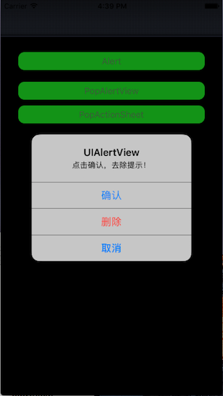
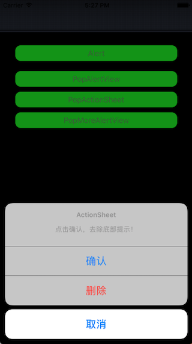
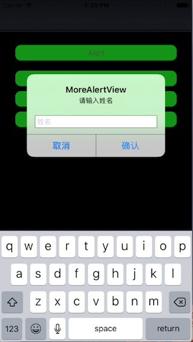

#庖丁UIKit之UIAlertController
做UI时，弹框消息基本是个必选项。无论是提示用户Warning消息，还是为用户提供一个交互选择，都是非常不错的选择。在iOS上UIKit肯定也是提供了相关功能的，在iOS8以前，UIKit提供了两种弹框： UIActionSheet 和 UIAlertView 。一个是从底部弹出，通常用于选择；一个是在界面中间弹出，一般用于提示。二者效果如下：

 

而在iOS8(包含iOS8)以后，UIKit通过UIAlertController将二者进行了统一，并提供了选项单元UIAlertAction，用于自定义弹框内容，显的更加灵活。

## 0. HelloWorld
先上代码：

    @IBAction func onAlert(_ sender: AnyObject) {
        let alert = UIAlertController(title: "HelloWorld", message: "你好，UIAlertController", preferredStyle: .alert)
        self.present(alert, animated: true) { 
            print("Show Alert!")
        }
        
    }
    
在看效果图：

代码逻辑很简单，就是在需要的地方，又按钮触发上面的逻辑，先创建一个UIAlertController然后`present(_ viewControllerToPresent: UIViewController, animated flag: Bool, completion: (@escaping () -> Swift.Void)`这个ViewController，就可以了。

> 注意：从图中可以看到，效果是有了，但是交互上有点缺陷，没法消除掉这个alert。
> 因为UIAlertController本质上是一个UIViewController，其展示的方式就是"present"一个Alert的UIViewController。所以展示之后需要调用其"dismiss"接口来去除，而UIAlertController已经将其集成到了内置的按钮UIAlertAction上了。

## 1. 在界面中间弹出蒙版提示
先来完善下上面的例子：

    @IBAction func onPopAlertView(_ sender: AnyObject) {
        let alert = UIAlertController(title: "UIAlertView", message: "点击确认，去除提示！", preferredStyle: .alert)
        let confirm = UIAlertAction(title: "确认", style: .default) { (UIAlertAction) in
            //
            print("Click Confirm")
        }
        alert.addAction(confirm);
        self.present(alert, animated: true) {
            print("Show Alert!")
        }
    }

效果如下：

    
要显示Alert，首先需要创建一个UIViewController，其构造函数为 

	init(title: String?, message: String?, preferredStyle: UIAlertControllerStyle)
其中：

* `title`就是图中黑色加粗的"UIAlertView",表示提示的标题。
* `message`是图中的“点击确认，去除提示!”的字眼，表示提示的具体内容，字体会小一号。
* `preferredStyle ` 关键的style来了，这个是个UIAlertControllerStyle类型的枚举：

		public enum UIAlertControllerStyle : Int {    
		    case actionSheet
		    case alert
		}
	有两个值，分别表示我们这里讨论的“AlertVIew”和“ActionSheet”类型，这里我们设置成`.alert`来使提示框在屏幕的中心位置。

在创建好UIAlertController之后，这里又创建了一个UIAlertAction来几个按钮，其构造函数为：

	init(title: String?, style: UIAlertActionStyle, handler: ((UIAlertAction) -> Void)? = nil)
这里的参数:

* `title`按钮上的文字，比如这里的“确认”、“取消”。
* `style`表示按钮的类型，是一个UIAlertActionStyle的枚举：

		public enum UIAlertActionStyle : Int {
		    case `default`
		    case cancel
		    case destructive
		}
	一次一般表示为“确认”、“取消”,这个`destructive`按照字面不是很好理解，可以认为其效果就是文字会显示为红色，表示危险操作，比如上面例子中的“删除”
* 最后的闭包表示按钮被按下后执行的相关动作。	

这里可以看到，多增加按钮时竖着依次排放的，不是左右各两个。如果只增加两个按钮,那么UIAlertController在显示的时候，会自动的按照横排的方式排放两个按钮。

如上面提到的，这些内置的按钮，在被点击后，首先会触发UIAlertAction中注册的动作，然后会调用UIAlertController的"dismiss"接口，消除提示的ViewController。

## 2. 在界面底部弹出选择提示
这次不上代码了，先上一个效果图：

只要把上面的`preferredStyle `改成`actionSheet `就可以实现图中的效果了。

代码上虽然没有什么不同，但是展示的UI效果却非常不同，首先页面从底部出现，其次“actionSheet”最大的特点在于把“cancel”按钮单独列出来了，并且和标题、消息内容是分开的非常醒目。

所以这个就需要根据场景进行选择。

## 3. 定制提示选项

UIAlertController提供了两个属性：

    open var title: String?

    open var message: String?
    
可以在创建完之后再对标题和消息内容进行设置。另外他还提供了一个可以增加输入框的功能，可以实现用于提示用户输入信息的功能。比如如下效果：

通过`func addTextField(configurationHandler: ((UITextField) -> Void)? = nil)`可以增加一个输入框到UIAlertController上，其显示在按钮的上方。在block中可以对UITextField属性进行设置，比如“placehold”文字。

同时UIAlertController还提供了：

	open var actions: [UIAlertAction] { get }
	
来获得添加的UITextField，当点击“确定”时，可以通过遍历这个数组来获得每个UITextField的输入内容。比如上图对应代码：

	@IBAction func onPopMoreAlert(_ sender: AnyObject) {
	        let alert = UIAlertController(title: "MoreAlertView", message: "请输入姓名", preferredStyle: .alert)
	        let confirm = UIAlertAction(title: "确认", style: .default) { (UIAlertAction) in
	            //
	            print("Click Confirm")
	            if let txt = alert.textFields?[0] {
	                print("Name is ", txt.text)
	            }
	        }
	        let cancel = UIAlertAction(title: "取消", style: .cancel) { (UIAlertAction) in
	            //
	            print("Click Cancel")
	        }
	        
	        alert.addTextField { (txt) in
	            txt.placeholder = "姓名"
	        }
	        
	        
	        
	        alert.addAction(confirm);
	        alert.addAction(cancel);
	        
	        self.present(alert, animated: true) {
	            print("Show Alert!")
	        }
	}

同样的，每个UIAlertAction也提供了

	 open var isEnabled: Bool
	 
来控制按钮是否可以操作。比如输入框为空时，让“确认”按钮处于不可按的状态。

## 4. 总结
在做App里面，用到提示信息的一般有

* 警告用户，比如没有输入、输入框为空
* 需要用户输入信息，比如输入查询条件
* 需要用户确认是否操作，比如删除时

前两者一般使用"alert"的方式，并且可以有输入框，而后者倾向于“取消”的，可以考虑用"actionSheet"的方式。