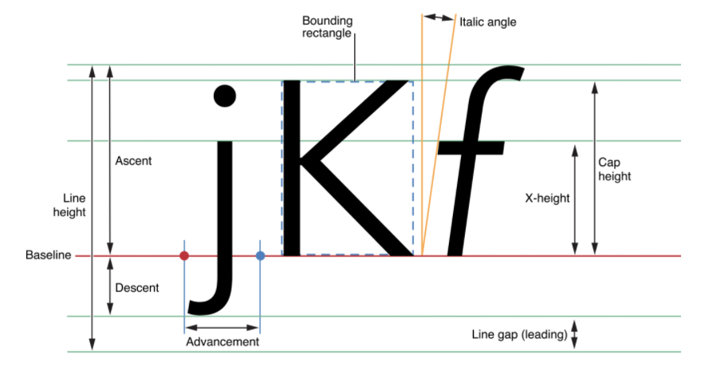

#庖丁UIKit之UIFont
App界面中少不了的肯定是各种各样的文字内容。那如何让文字在不同的位置都有相应的表现效果呢？像Word操作一样，自然干是通过设置各种各样的字体来表达不同的效果。UIKit为此提供了UIFont类型来表示字体。当然，UIFont只是粗略的对已有的字体进行表现，如果希望定制更炫的文本效果,比如数学表达式、电子书，则还需要求助于"CoreText.framework"。
## 创建系统默认字体
iOS系统默认支持好几种字体，并且系统界面也是有特定字体的，比如iOS9就因为更新了新字体--中文字体「苹方」以及英文字体「San Francisco」，被大家甚是调侃了一番。

所以最简单的创建字体的方式就是用系统默认的字体，比如：

	class func systemFont(ofSize fontSize: CGFloat) -> UIFonts // 获取指定大小的系统字体
	class func systemFont(ofSize fontSize: CGFloat,                weight: CGFloat) -> UIFont // 获取指定大小和粗细的系统字体
	class func boldSystemFont(ofSize fontSize: CGFloat) -> UIFont //获得指定大小的粗体系统字体
	class func italicSystemFont(ofSize fontSize: CGFloat) -> UIFont // 获取指定大小的斜体系统字体
	class func monospacedDigitSystemFont(ofSize fontSize: CGFloat,                               weight: CGFloat) -> UIFont // 获取指定大小和粗细的系统字体，并且其中的数字字符间距相等
	
这里介绍的几种方法，无非是在字体大小、粗细、斜体上不同的,但都是系统当前的默认字体。除此之外，iOS10还提供了一套UI推荐标准字号方法：
	
	class func preferredFont(forTextStyle style: UIFontTextStyle) -> UIFont

其通过枚举值规定了各个场景的字号，比如

* 大标题 `.title1` 类似HTML的h1
* 中标题 `.title2` 类似HTML的h2
* 小标题 `.title3` 类似HTML的h3
* 大抬头 `.headline`
* 小抬头 `.subheadline`
* 文本内容主体  `.body`

用这里的枚举，会更符合[iOS Human Interface Guidelines](https://developer.apple.com/ios/human-interface-guidelines/overview/interface-essentials/)

## 获取系统支持的字体
当然，系统除了默认字体以外还内置支持了很多自带字体，我们可以通过UIFont的类方法：

	class func fontNames(forFamilyName familyName: String) -> [String]
获得系统内置的字体族中所有字体的名称。然后再通过

	init?(name fontName: String,  size fontSize: CGFloat)
用字体名来创建指定字体。

那这里字体族如何知道呢？一样的UIFont提供了接口：

	class var familyNames: [String] { get }

比如在iOS10.0.2上，系统自带的字体:

    let family = UIFont.familyNames
    for fam in family {
        let fonts = UIFont.fontNames(forFamilyName: fam)
        print("Font Family: \(fam)")
        for f in fonts {
            print("\t\t Font:\(f)")
        }
    }

得到一个特别长的列表：
	
	Font Family: Copperplate
			 Font:Copperplate-Light
			 Font:Copperplate
			 Font:Copperplate-Bold
	Font Family: Heiti SC
	Font Family: Kohinoor Telugu
			 Font:KohinoorTelugu-Regular
			 Font:KohinoorTelugu-Medium
			 Font:KohinoorTelugu-Light
	Font Family: Thonburi
			 Font:Thonburi
			 Font:Thonburi-Bold
			 Font:Thonburi-Light
	Font Family: Heiti TC
	Font Family: Courier New
			 Font:CourierNewPS-BoldMT
			 Font:CourierNewPS-ItalicMT
			 Font:CourierNewPSMT
			 Font:CourierNewPS-BoldItalicMT
	...

## 获取字体属性
字体的组成结构和空间占用在Apple的[Text Programming Guide for iOS](https://developer.apple.com/library/content/documentation/StringsTextFonts/Conceptual/TextAndWebiPhoneOS/Introduction/Introduction.html#//apple_ref/doc/uid/TP40009542)有详细描述，当然我们这里不去深究CoreText的排班过程，仅看看对UIKit的影响，来看一个字体的空间：

UIFont提供了一系列的Getter来获得这些属性：

属性| 类型| 含义
---|---|---
pointSize| CGFloat | 字体大小
ascender| CGFloat | 字体基线距离最高点的位置
descender| CGFloat | 字体的基线距离最低点的位置
leading| CGFloat | 前导距离
capHeight| CGFloat | 主体高度
xHeight| CGFloat | 重心高度
lineHeight| CGFloat | 行高

这些属性用中文描述出来，不是特别容易理解，可以将属性名对照上面的图进行理解。

除了这几个属性，还可以通过下面的方法获得字体的名称：

	var familyName: String { get }
	var fontName: String { get }
前者获取字体的家族名，后者获得字体名。

## 创建自定义字体
说完系统字体，现在我们来说这篇文章的重点，如何加载自定义字体。根据资源的提供者，我们可以分成三类来说：随包Bundle、动态数据文件以及Apple提供的系统扩展

### 随包Bundle字体
最简单的方式就是如同做PC端应用或者做游戏一样，把一个字体包当做一个Bundle资源打入ipa包中。所以我将他称为"随包Bundle字体"。比如要在App中加入Monaco这个程序员专属字体。

首先将自己的字体文件像一个Bundle文件一样加入到Xcode工程中，比如这里我加入一个MONACO.ttf的字体文件，然后在plist文件中添加“Fonts provided by application”表示数组的字段，里面每个单元就是一个要加入的字体的文件名。

之后，在我们的系统库中就有了这个字体了，比如上面的枚举系统的代码就会看到：

	Font Family: MONACO
		 Font:MONACO
最后我们再如上面介绍的调用：

	let monacoFont = UIFont(name: "Monaco", size: UIFont.systemFontSize)
来创建一个Monaco字体。	

这个方法虽然简单，但是也带来了一些缺点。比如发布包ipa会以为字体而变大。

### 动态数据文件字体
上面说了，虽然“随包Bundle字体”能很方便的解决增加一个系统不支持的字体的问题，但是随之带来的却是ipa包的增大。那要如何解决呢？

做程序猿的自然就会想到，能不能资源不随包发布，而在程序运行的期间从网上下载到document目录在加载呢？

答案当然是肯定的，所以我又将其称为“动态数据文件字体”。但是要用到一个不属于UIKit的技术：CoreText里面的`CTFontManagerRegisterGraphicsFont `函数,所以我们需要先 :

	import CoreText

然后假设字体文件内容下载到了`NSData`中

	let fontData = NSData(contentsOfFile: fontURL!) //这里用本地文件模拟网络下载到NSData中
来看完整代码：

	let monacoFont = UIFont(name: "Monaco", size: UIFont.systemFontSize)
	print("monacoFont is \(monacoFont)")
	let fontURL = Bundle.main.path(forResource: "MONACO", ofType: "ttf")
	let fontData = NSData(contentsOfFile: fontURL!)
	let providerRef = CGDataProvider(data: fontData!)
	let fontRef = CGFont(providerRef!)
	var error: Unmanaged<CFError>?
	if CTFontManagerRegisterGraphicsFont(fontRef, &error) {
	    let mFont = UIFont(name: "Monaco", size: UIFont.systemFontSize)
	    print("mFont is \(mFont)")
	}
可以得到输出：

	monacoFont is nil
	mFont is Optional(<UICTFont: 0x100c11cc0> font-family: "MONACO"; font-weight: normal; font-style: normal; font-size: 14.00pt)
第一次没有“MONACO”等注册后就有了。

这里要注意下，Swift3以后CoreText.framework的改变。这里用了`CGDataProvider `以及`CGFont `。

### Apple提供的系统扩展字体
通过动态下载字体文件好像基本上完美解决所有问题了，但是还有个小问题，很多字体尤其是中文字体都是有版权的，如果App发现量巨大，这块被发现了就不好了。但是iOS系统就只提供了上面罗列出来的哪些字体么？好像都没几个中文的。

既然中国用户为Apple共享了那么多美金，Apple自然也不会忘记中文的支持，我们会发现Mac上提供了“字体簿”（FontBook）是提供了N多中文字体，比如中国特色的“隶书”：

这里会看到有个“PostScript name”,Apple提供了一种通过这个名称下载字体到自己的手机系统位置的方式，也就是为出厂的手机系统的位置（`/private/var/mobile/Library/Assets/com_apple_MobileAsset_Font/`）新增一个字体，并且所有的应用都可以用了（上面两种方法都是针对当前App）的。

这里我们查询到图中的隶书的PostScript为“STBaoliSC-Regular”,然后我们一样用CoreText的服务：

    let fontPSName = "STBaoliSC-Regular"
    
    var attr : [String:String] = [kCTFontNameAttribute as String : fontPSName]
    let desc = CTFontDescriptorCreateWithAttributes(attr as CFDictionary)
    var descs : [CTFontDescriptor] = [desc,]
    CTFontDescriptorMatchFontDescriptorsWithProgressHandler(descs as CFArray, nil) { (stat, prama) -> Bool in
        //
        if .didFinish == stat {
            let nishuFont = UIFont(name: fontPSName, size: UIFont.systemFontSize)
            print("nishuFont is \(nishuFont)")
        }
        return true
    }
如果你是使用的Xcode8的话，会发现这里有一堆的下载日志，当然最后回打印：
	
	"SandboxExtension" => <string: 0x174250170> { length = 249, contents = "524979fa2be9f37ea83d93d0f3f00b1ef8977255;00000000;00000000;0000000000000015;com.apple.assets.read;00000001;01000004;00000000014f47f8;/private/var/MobileAsset/Assets/com_apple_MobileAsset_Font3/3abf40766b4cf50b77ebd28e6affbd1849ea61c6.asset/AssetData" }
	}
	nishuFont is Optional(<UICTFont: 0x100c16b90> font-family: "STBaoliSC-Regular"; font-weight: normal; font-style: normal; font-size: 14.00pt)

这里可以看到，字体下载到了"/private/var/MobileAsset/Assets/com_apple_MobileAsset_Font3/3abf40766b4cf50b77ebd28e6affbd1849ea61c6.asset/AssetData"，然后成功创建了字体。这里注意哈，字体名也是“PostScript name”而不是截图中的字体名。

这里使用了CoreText的`CTFontDescriptorMatchFontDescriptorsWithProgressHandler `，一个下载字体的系统服务。既然是下载动作，肯定是异步的了，所以这里用了一个闭包`CTFontDescriptorProgressHandler`：

	typealias CTFontDescriptorProgressHandler = (CTFontDescriptorMatchingState, CFDictionary) -> Bool
来处理回调结果。`CTFontDescriptorMatchingState`定了了各个下载结果，这里，我们只关注了成功的结果。而`CFDictionary`里面则包含了进度（kCTFontDescriptorMatchingPercentage）等信息

因为下载动作不是在UI线程里面，所以这里假设要更新UI上的下载进度，需要通过`dispatch_async `来实现。

stat|下载状态
---|---
didBegin |开始下载时
didFinish | 下载完成时
willBeginQuerying | 第一次向服务器发起查询时
stalled | 等待服务器相应
willBeginDownloading | 每当有新字体下载时
downloading | 正在下载
didFinishDownloading | 一次下载完成
didMatch | 当找到一个字体
case didFailWithError | 出错时

下载信息key|类型| 下载信息值| 对应状态
---|---|---|---
kCTFontDescriptorMatchingSourceDescriptor| UIFontDescriptor |当前字体下载完成时|.didFinish
kCTFontDescriptorMatchingDescriptors|Array|要下载的字体描述，|willBeginQuerying
kCTFontDescriptorMatchingResult|Array|匹配的字体描述UIFontDescriptor|.didMatch
kCTFontDescriptorMatchingPercentage|CFNumber| 进度0-100之间|.downloading
kCTFontDescriptorMatchingCurrentAssetSize|CFNubmer| 当前下载大大小| .downloading
kCTFontDescriptorMatchingTotalDownloadedSize|CFNumber| 总下载大小| .downloading
kCTFontDescriptorMatchingError|CFError| 出错信息|.didFailWithError

## 总结
UIFont提供了对系统自带字体的访问，从而为UILabel、UITextView等提供丰富的字体支持。除了可以设置系统自己的字体之外，UIFont还可以创建自己提供的资源字体，字体资源既可以随包打入ipa也可以放在网络上通过下载到资源包中，同时Apple还提供了大量的扩展字体。通过这些字体，我们可以对UI界面做非常大的自定义。但是UIFont并不能解决所有的文字排版问题，类似于数学表达式，电子书排版这种负责的文字排版，我们还需要借助CoreText.framework。

##参考：
1. [Text Programming Guide for iOS](https://developer.apple.com/library/content/documentation/StringsTextFonts/Conceptual/TextAndWebiPhoneOS/Introduction/Introduction.html#//apple_ref/doc/uid/TP40009542)

2. [UIFont Class Reference](https://developer.apple.com/reference/uikit/uifont)