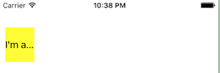
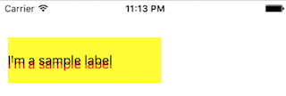
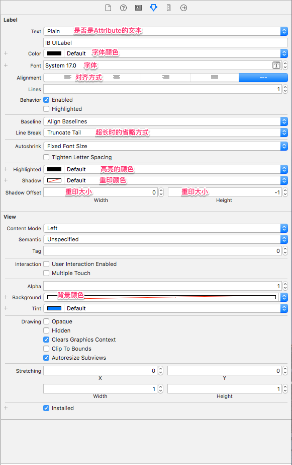

#庖丁UIKit之UILabel
在APP UI绘制过程中，少不了的要展示一行文本信息。UIKit通过UILabel来提供一个只读的文本视图。使用UILabel不仅可以显示单行还可以显示多行内容，并且还可以对字体、背景、填充方式等进行自定义设置，从而满足各种效果需求。如果这还不够满足你们XX产品的XX需求，由于UILabel是集成自UIView的，所以你还可以通过派生子类来进一步进行UIView的修改完成对UILabel的自定义。
## 0. 添加一个Label
首先直接上代码：

    func layoutLabel () {
        let lbl = UILabel()
        lbl.text = "I'm a Label"
        lbl.frame = CGRect(x: 10, y: 48, width: 100, height: 30)
        self.view.addSubview(lbl)
    }
然后看效果：

会发现UILabel的使用非常简单,用构造函数创建一个UILabel对象，然后设置下其位置，在设置下label的具体值内容，就可以在要显示的父View上面调用`addSubview`将其显示了。这里虽然用了frame的方式来布局，由于UILabel继承自UIView，所以当然也可以或者说更应该用AutoLayout来进行布局。

## 1. 自定义Label外观

###设置文字内容
UILabel显示的内容主要是一段文字和一个背景也就是容器View。文字的设置通过

	var text: String? { get set }
来改变，只要设置了其值，在显示的时候就会按照这个内容进行显示。

### 设置背景
而背景则通过设置容器View的相关属性来实现。具体可以参见[庖丁UIKit之UIView]()
比如设置背景为黄色：

	lbl.backgroundColor = UIColor.yellow
### 设置对齐方式	
说到文字内容排班，那么自然少不了对齐方式,UILabel通过属性方法：

	var textAlignment: NSTextAlignment { get set }
设置对齐方式NSTextAlignment，对齐方式有

* case left : 左对齐
* case center：居中对齐
* case right : 右对齐

除此之外还有基本情况都等同于"left"的 `case justified` 和 `case natural`。

###设置填充效果
在使用UILabel的时候，一个比较囧的情况就是，当文字的内容长度大于UILabel的长度的时候，就会出现“XXX...”三个点装的省略符号，而不能显示完整的内容。比如代码设置：

	lbl.text = "I'm a sample label"
	lbl.frame = CGRect(x: 10, y: 48, width: 50, height: 60)
	lbl.backgroundColor = UIColor.yellow

效果为

这里可以通过设置label的`var lineBreakMode: NSLineBreakMode { get set }`来控制省略哪一部分，默认是和上面一样的省略尾部。

省略方式| 效果
---|---
byTruncatingHead | 从头开始省略比，如: "...wxyz"
byTruncatingTail | 从尾部开始省略，如: "abcd...",默认就是这个属性，所以默认会看到三个点
byTruncatingMiddle| 从中间开始省略，如:  "ab...yz"

那如果不想出现省略号，怎么办呢？这里只要设置

	var adjustsFontSizeToFitWidth: Bool { get set }
为`true`UILabel就会自动调整字体的大小，使得其可以完整的显示出来。比如：

此法虽好，但是有个缺陷是，他会无限缩小字体直达可以完全容纳所有的文字，此时虽然文字可以都显示，但是人眼基本是认不出来了(如上图)，这样其实还不如显示一部分，其他的省略，用户还可以猜猜。此时，我们需要设置字体的`minimumFontSize`来进行控制，字体设置参见下一节介绍。

###多行显示
默认UILabel是只有一行的，即使在内容中添加"\n"也没有用，"\n"之后内容就被舍弃了。此时需要你自己来判断当前有多少行内容，然后设置：

	var numberOfLines: Int { get set }
为对应的值。

### 将内容高亮
有时候为了让文字内容醒目，我们会设置高亮效果，UILable也支持这个特性，通过设置

	var isHighlighted: Bool { get set }
为true并设置高亮颜色：

	var highlightedTextColor: UIColor? { get set }
就可以设置高亮了，比如：

### 设置重印
在Word艺术字里面有一个重印效果，可以让文字比较醒目，同样的UILabel也支持这一的效果，通过设置:

	var shadowColor: UIColor? { get set }
为指定的颜色，然和设置重印的大小

	var shadowOffset: CGSize { get set }
这里CGSize表示一个矩形，可以认为是一个偏移向量。比如把`with`设置成0，重印就会是往下延长型,比如：

###根据字体实际内容大小设置Frame
假设有这样的一个需求，要怎么实现：

这里我们要准备两个资源，一个是竖线，一个是半圆，标题用UILabel来实现，让后内容设置成背景图片竖线，让他自动填充。这样我们就完成了矩形部分了。

那半圆该放在那里呢？因为标题的内容是不确定的，所以无法知道半圆的x坐标该给多少。UILabel给出的解决方案就是：

	func textRect(forBounds bounds: CGRect, limitedToNumberOfLines numberOfLines: Int) -> CGRect
返回UILabel中内容真实需要的范围。

这里`bounds `表示接受对象的bounds值，也就是结果的最大值。  `numberOfLines `表示内容有几行。所以这里调用：
	
	lbl.textRect(forBounds: lbl.frame, limitedToNumberOfLines: 0)
	
就可以计算出其真实长度了。

## 2. 设置Label的字体

### 修改字体颜色
最简单的设置字体，就是设置他的颜色了。

	var textColor: UIColor! { get set }
给一个既定的UIClolor即可。UIColor的使用参见[庖丁UIKit之UIColor]()

### 给定字体
UILabel还有个字体属性，可以设置成需要的字体：

	var font: UIFont! { get set }
给定义字体即可，UIFont参见[庖丁UIKit之UIFont]()
### 设置属性字体
上面的设置字体和字体颜色，都是针对整个UILabel中的文字的，如果要各个单词区别要如何实现呢？可以使用NSAttributedString进行辅助。通过设置：

	@NSCopying var attributedText: NSAttributedString? { get set }
为指定的NSAttributedString可以修改UILabel的内容。不同于UIFont，当设置了这个属性之后，原来的`text`属性中的值就不会再显示了。取而代之的是显示`attributedText `的内容。比如我们要显示一段带下划线的文字：

    lbl.backgroundColor = UIColor.yellow
    lbl.frame = CGRect(x: 10, y: 48, width: 200, height: 60)
    let txt = "I'm a attribute Text"
    let attrText = NSMutableAttributedString(string: txt )
    attrText.addAttribute(NSUnderlineStyleAttributeName, value: 2, range: NSRange(location: 0, length: txt.lengthOfBytes(using: .utf8)))
    lbl.attributedText = attrText
    self.view.addSubview(lbl)
 效果如下：
 
 
 当然可以通过配置NSMutableAttributedString来获得更多的效果。

## 3. 通过IB更好的了解Label
上面描述的控制UILabel的属性，基本都可以在IB中进行直观的设置。

## 参考
[UILabel Class Reference](https://developer.apple.com/reference/uikit/uilabel)
[View Programming Guide for iOS](https://developer.apple.com/library/content/documentation/WindowsViews/Conceptual/ViewPG_iPhoneOS/Introduction/Introduction.html#//apple_ref/doc/uid/TP40009503)
[Labels in UIKit User Interface Catalog - Label](https://developer.apple.com/library/content/documentation/UserExperience/Conceptual/UIKitUICatalog/UILabel.html#//apple_ref/doc/uid/TP40012857-UILabel)