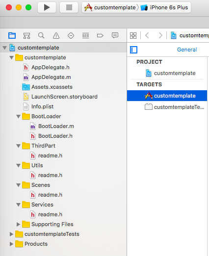
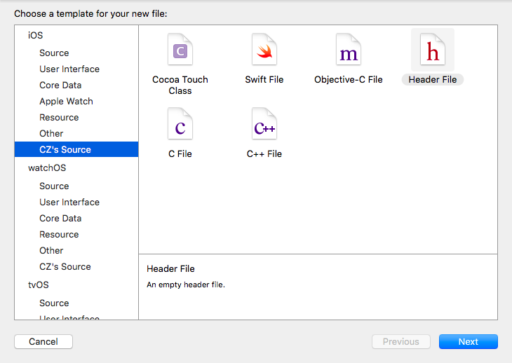
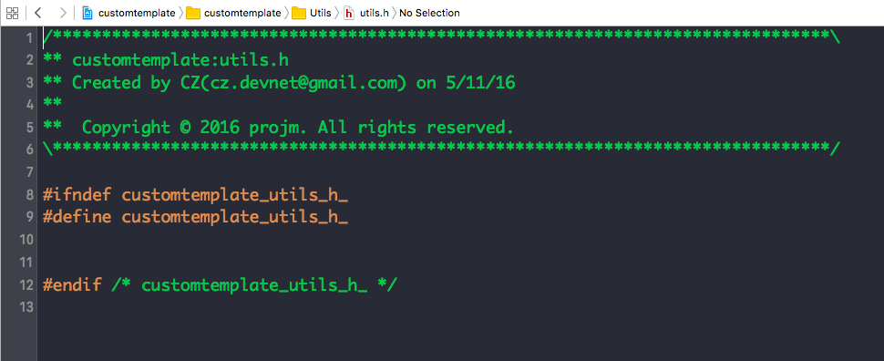
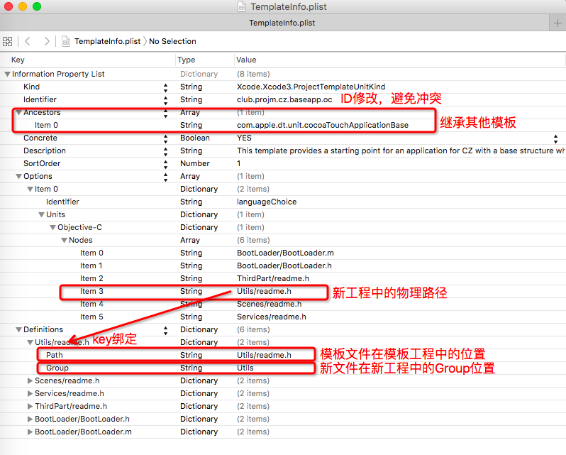

#定制你的Xcode工程目录和文件模板
在创建Xcode工程的时候，有几个默认的模板可以选择，比如“Application”里面“Signal View Application”，或者是一个“Framework & Library”里面的"CocoaTouch Framework"。这些模板点击进去后就为我们自动生成了一些文件，并且文件中也有些模板注释。但是这样就够了么？Apple的设定是否能满足你的需求呢？

先来看下我的定制效果：

当在Xcode里面点击"File"->"New" -> "Project"的时候，首先得到工程模板的选择，这里我自定义了一个自己的“Application”模板

也就是这里的“CZ's Application”，里面有两个模板工程，一个是OC的一个是Swift的，这里我们看选择一个OC工程模板后的结果。

这里我们可以和最常用“Signal View Application”做个对比，首先没有“Main.storyboard”了，也没有了那个特定"View"的“ViewController”，取而代之的我自己规划的 

* BootLoader: 启动时操作，比如初次安装的欢迎页，是否显示广告页
* Scenes: 各个操作界面的场景
* Services: 将MVC中较为重和独立的逻辑（比如后台API访问）抽成独立的Service供其他模块使用
* Utils: 工具目录
* ThirdPart: 没有CocoaPod支持的或者一些开源的代码片段

再在目录上点击右键，然后选择“New File”看文件选择界面

这里看到多了一个“CZ's Source”，在里面有常见文件类型可以选择。这里选择.h文件，新建文件如下：

可以看到这里和"//"注释的默认模板不同的地方。头文件的ifndef也改成了google的C++风格了。

## 1. Xcode模板文件结构

### 工程模板结构
Xcode的模板文件和vim/emacs等编辑器一样有两个位置，一个系统的全局位置，一个用户的自定义位置,现在用Xcode基本是做iOS开发，这里就只以iOS作为例子讲解，后面的文章都是说iOS工程的：

	全局位置：/Applications/Xcode.app/Contents/Developer/Platforms/iPhoneOS.platform/Developer/Library/Xcode/Templates/Project Templates/
	以及 ： /Applications/Xcode.app/Contents/Developer/Library/Xcode/Templates/Project Templates
	用户自定义位置：~/Library/Developer/Xcode/Templates/
	
全局路径需要root的读写权限，一般不用修改他，把自己的定制模板文件放在用户自定义的路径下就可以了。

模板的文件格式是这样的：

	Single\ View\ Application.xctemplate/
	├── Main.storyboard
	├── TemplateIcon.tiff
	└── TemplateInfo.plist

首先是目录名，然后目录名下会有一个tiff图片文件，其是48*48大小的图标文件，出现在选择界面中，比如"Singal View"的图标就是一框框里面一个“1”。而目录名就是工程模板选择界面中的模板名称。模板的内容在plist文件里面定义，如果工程中需要自定义一些自动生成的文件，也放在这个目录下，比如"Singal View"需要一个storyboard，那么就把这个预先写好的文件也放在这个目录下，具体会在生成的工程中的哪个位置，以及在Xcode工程中Group的位置，后面再介绍。

上面这个仅仅是定义了一个目标的结构，那么在工程选择界面中，左边列表的分类又是如何定义的呢？实际上就是取工程模板的上级目录名称，比如上面的“Signale View Application.xctemplate”其上级目录是“Application”,所以我们看到在工程选择目录里面，先点左变的“Application”再选择“Signal View”，其他的选择还有:

	Application
	├── Cocoa\ Touch\ Application\ Base.xctemplate
	├── Cocoa\ Touch\ Application\ Testing\ Bundle.xctemplate
	├── Cocoa\ Touch\ Application\ UITesting\ Bundle.xctemplate
	├── Core\ Data\ Cocoa\ Touch\ Application.xctemplate
	├── Game.xctemplate
	├── Master-Detail\ Application.xctemplate
	├── Page-Based\ Application.xctemplate
	├── Single\ View\ Application.xctemplate
	├── Storyboard\ Application.xctemplate
	└── Tabbed\ Application.xctemplate
	
就是Application的完整分类了。

所以要定义我们自己的工程模板，只要在 “~/Library/Developer/Xcode/Templates/”目录下建一个分类目录，再在分类目录里面建工程模板目录就可以了，比如上面的“CZ's Application”：

	└── CZ's \200\230s\ Application
    ├── OC\ Base\ Application.xctemplate
    └── Swift\ Base\ Application.xctemplate
### 文件模板结构   
至于文件模板也是一样类似的结构：

	全局位置：/Applications/Xcode.app/Contents/Developer/Platforms/iPhoneOS.platform/Developer/Library/Xcode/Templates/File Templates
	以及：/Applications/Xcode.app/Contents/Developer/Library/Xcode/Templates/File Templates 
	用户自定义位置:/Users/cz/Library/Developer/Xcode/Templates
	
文件模板的结构：

	Objective-C\ File.xctemplate/
	├── CategoryNSObject
	│   ├── ___VARIABLE_extendedClass:identifier___+___VARIABLE_productName:identifier___.h
	│   └── ___VARIABLE_extendedClass:identifier___+___VARIABLE_productName:identifier___.m
	├── Empty\ File
	│   └── ___FILEBASENAME___.m
	├── ExtensionNSObject
	│   └── ___VARIABLE_extendedClass:identifier_______VARIABLE_productName:identifier___.h
	├── Protocol
	│   └── ___FILEBASENAME___.h
	├── TemplateIcon.png
	├── TemplateIcon@2x.png
	└── TemplateInfo.plist

同样的“TemplateIcon.png”是选择界面中的图标文件。以"___"打头的是真正的文件模板文件。最后用plist来控制那些文件最后位于工程中的哪个位置。

同样，分类也是以文件模板目录的上级目录来定义的，比如有“User Interface”分类，有“Source”分类：

	├── Core\ Data
	│   └── NSManagedObject\ subclass.xctemplate
	├── Source
	│   ├── C\ File.xctemplate
	│   ├── C++\ File.xctemplate
	│   ├── Cocoa\ Class.xctemplate
	│   ├── Header\ File.xctemplate
	│   ├── Objective-C\ File.xctemplate
	│   ├── Objective-C\ new\ superclass.xctemplate
	│   ├── Playground\ Page.xctemplate
	│   ├── Playground\ with\ Platform\ Choice.xctemplate
	│   ├── Playground.xctemplate
	│   ├── Sources\ Folder\ Swift\ File.xctemplate
	│   ├── Swift\ File.xctemplate
	│   ├── UI\ Test\ Case\ Class.xctemplate
	│   └── Unit\ Test\ Case\ Class.xctemplate
	└── User\ Interface
	    ├── Application.xctemplate
	    ├── Empty.xctemplate
	    ├── Main\ Menu.xctemplate
	    ├── Storyboard.xctemplate
	    ├── View.xctemplate
	    └── Window.xctemplate
	    
所以要定制我们自己的代码模板，只要首先建立分类目录，然后在分类目录里面建立代码模板目录就可以了，比如上面的“CZ‘s Source”结构为：

	CZ's\ Source/
	├── C\ File.xctemplate
	├── C++\ File.xctemplate
	├── Cocoa\ Touch\ Class.xctemplate
	├── Header\ File.xctemplate
	├── Objective-C\ File.xctemplate
	├── Objective-C\ new\ superclass.xctemplate
	├── Sources\ Folder\ Swift\ File.xctemplate
	└── Swift\ File.xctemplate

这样在新建Xcode工程的时候，就可以有自己的分类和文件选择了。

这里仅仅建立了目录，你会发现还是没有用的，必须里面的plist文件要写好，其实Xcode主要就是根据这个plist配置文件来建立工程，最开始的时候可以去系统木copy几个过来，先建立结构，在做修改定制。

还要注意下，对于代码部分，“/Applications/Xcode.app/Contents/Developer/Library/Xcode/Templates/File Templates”这个路径下的Cocoa 文件模板是不可用的，需要从“/Applications/Xcode.app/Contents/Developer/Platforms/iPhoneOS.platform/Developer/Library/Xcode/Templates/File Templates”这里copy，但是后者没有C/C++等的文件模板。所以要自己做个合并。

## 2. Xcode模板定制
### 工程模板定制
工程模板里面除了logo标签，最主要的就是要修改工程的结构，比如一些预定的Group，一些实现编写好的文件：

首先要修改下“Identifier”字段，以防冲突。

Xcode模板是支持继承的，或者叫做Import，这里“Ancestors”字段以数组的方式列出了要继承的对象，上面只继承了“com.apple.dt.unit.cocoaTouchApplicationBase”，这个是和Xcode6一起的Empty工程类似的。
而“Signal View”工程则继承了 "com.apple.dt.unit.storyboardApplication" 和“com.apple.dt.unit.coreDataCocoaTouchApplication”,而“com.apple.dt.unit.storyboardApplication”
又是继承了上面的“com.apple.dt.unit.cocoaTouchApplicationBase”。 具体其定义了什么，可以对比着看下，在系统的工程模板位置，比如“Main.storyboard”是如何别加入工程的。

然后就可以在此基础上开始修改结构了。主要涉及两个位置

* Options[0].Units.Objective-C.Nodes[] OC的用“Objective-C”字段: 每个Node是一个新工程中的具体物理文件位置，目录自动创建，如果没有在后面的Definitions中指定，则吧路径中的最后的的文件加入到工程的代码跟目录下。
* Definitions.Xxx : 这里Xxx就是上面的Node的值，其实一个字典类型，主要有两个键： 
	1. Path: 模板文件（也就是要被拷贝的文件）所在工程模板中的位置
	2. Group: 新工程中，这个文件所在的Group

通过这样的组合就可以确定模板工程目录下的一个文件比如“Main.storyboard”在新工程的哪个位置（Node的值）,以及在哪个Group（Definitions里面的Group）从而完成对目录结构的自定义。

上面的截图，就会生成最开始的“OC Base Application”的工程截图，其中有“Utils”、“ThirdPart”、“Scenes”等目录结构。

### 文件模板定制
文件模板没什么好说的。只要改改对应文件类型的内容就可以了。通过上面的合并，基本覆盖了日常开发所需要的文件类型。这里介绍文件模板中的几个占位符：

占位符|意义
---|---
`___FILENAME___` | 当前的文件名
`___PROJECTNAME___`| 当前工程名，在创建工程时设置的
`___FULLUSERNAME___` | 当前登录用户的名字
`___DATE___` | 当前日期 ，格式为MM/DD/YY
`___FILEBASENAMEASIDENTIFIER___` | 不带后缀的文件名

这里介绍下plist里面copy文件的目录：

这里以C++举例，因为Xcode7之后新建的带有头文件的C++文件，其头文件是“abc.hpp”的格式，非常恶心。所以我们可以根据这个规则找到“WithHeader”目录，然后把里面文件改成.h和cpp里面的"include .h"形式。

## 3. 总结
文章开头的自定义模板可以在我的[Github](https://github.com/cz-it/cz_base_app)上下载，修改下建立个软连接就可以直接使用了。

	cd ~/Library/Developer/Xcode/Templates/
	ln -s YourPath/github.com/cz-it/cz_base_app/Project\ Templates Project\ Templates 
	ln -s YourPath/github.com/cz-it/cz_base_app/File\ Templates File\ Templates

现在可以搜到蛮多的定制模板的文章都是Xcode4或者6的，其方法也已经不再适用了，另外在Xcode7的7.2和7.3在工程结构上也有些比较大的改变（模板文件路径），所以定制模板的方法还是要与时俱进，要对Xcode进行适配。

另外由于Apple自己没有公开他们的工程目录结构定义（plist的格式说明文档），所以我们也只能根据Xcode已有的文件进行逆向猜想，还有些诸如Target定义、info plist修改在文中都没有涉及，这个过程还需要自己参考Xcode的模板，不断的尝试，才能得到自己想要的效果。

## 参考
1. [Xcode Build Setting Reference](https://developer.apple.com/library/ios/documentation/DeveloperTools/Reference/XcodeBuildSettingRef/0-Introduction/introduction.html#//apple_ref/doc/uid/TP40003931-CH1-SW1)
2. [XCode 4 Projects and Files Template Folder](https://snipt.net/raw/b216c160f38e9b3c095222607739b21c/?nice)
2. [How to Create Custom Project Templates in Xcode 7](http://www.telerik.com/blogs/how-to-create-custom-project-templates-in-xcode-7)