#通过Navigation创建一张大众脸的App

拿出iPhone。随手点开几个系统应用，比如“信息”，我们会看到如下的界面结构：

 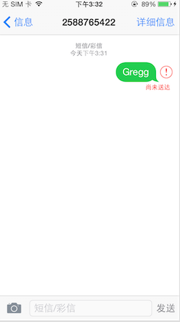

或者点开“设置”也会发现他是有个首部的标题栏加上“Body"部分内容，然后再内容中点击后会跳转到子界面，并且在子界面中保留了首部，同时首部会有“返回”字样的按钮可以会
到上一层界面中。

这样的一个界面结构在App中比较常见，可谓是一张“大众脸”。

## 二、Navigation是什么
在Developer的文档中有这么一篇 [《View Controller Catalog for iOS》](https://developer.apple.com/library/ios/documentation/WindowsViews/Conceptual/ViewControllerCatalog/Introduction.html#//apple_ref/doc/uid/TP40011313-CH1-SW1)
说是介绍iOS上ViewController分类的，但是真正的ViewController肯定远不止这几类，但是这里的几类确是最基本的几类，一般用来构成一个App最基础的骨架，所以才有了上面的那张“大众脸”，Navigation就是其中的一种。
> A navigation controller is an instance of the UINavigationController class that you use as-is in your app. Apps that contain structured content can use navigation controllers to navigate between levels of content. The navigation controller itself manages the display of one or more custom view controllers, each of which manages the data at a specific level in your data hierarchy. The navigation controller also provides controls for determining the current location in this data hierarchy and for navigating back up the hierarchy.

这篇文章介绍说一个Navigation Controller 是一个容器ViewController，用来管理多个其他的承载显示View的View Controller，其最主要的功能就在于控制当前加载哪个View Controller并提供返回路径。Developer网站上的文档给了一个App的示意图来展示
Navigation在一个App中的物理存在：

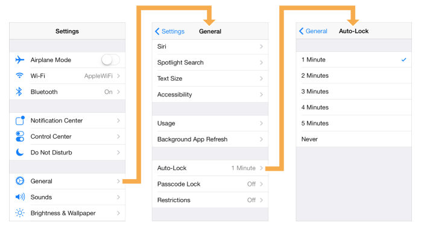

从图中可以看到上面定义中的“管理并加载当前的ViewController”已经“提供返回路径”。从Developer的文档中我们可以看到Navigation的组成如下：

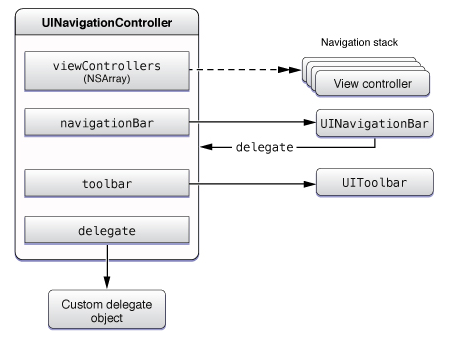

用一个数值存储这UIViewController，从而可以完成跳转操作，然后用UINavigationBar来定义界面的首部，从而提供返回按钮，toolBar定义了界面的尾部，提供一些自定义界面的可能。同时还通过delegate来监听事件的改变。

## 三、在不同的项目界面中跳转

我们创建一个简单的工程测试一下这个“管理加载”和“返回路径”的功能。首先创建一个“Single View”的工程，但是我们这里不用storyboard,直接手写更能说明问题。根据前一篇文章[Swift App中的Main Loop]()中描述的，其实我们只要"AppDelegate.swift"这一个文件就可以了。
我们修改这个文件：

这里我们首先定义一个成员 `var navVC : UINavigationController?`，由于我们不在构造函数里面做初始化，所以将其定义为 “optional”变量，原因参见[Swift语法：继承中的构造函数]()这篇文章。上面有说到，UINavigationController只是一个容器ViewController。其
并不能用来作为主界面的view的显示，所以需要为其设置一个rootViewController，这就和要为window设置一个rootViewController的原理类似。因此我们创建一个最简单的类似一个白板幕布一样的“UIViewController”对象。并在创建“UINavigationController”的时候再构造
函数里面进行设置。

因为需要进行内容的显示，这里我们用了一个容器View "UIView"，并创建了一个Button用来切换到下一个界面。这里有点注意的在iOS7以后，UIButtonType中已经没有圆角了，用System进行替代，如果要定义外观可以用图片。这里就是简单的创建一个UIView和一个UIButton，然后为button设置一个触发时候的动作，并将button用addSubview的方式加到容器View上面，再将容器View设置为UIViewController的view，就可以进行显示了。别忘了最后将UINavigationController设置成window的rootControllerView。这里运行时效果如下：

 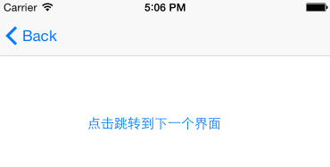

这里Button的触发函数里面和前面一样，就是创建一个UIViewController和一个背景View，然后增加一个按钮，同时这个按钮的触发也再执行这个逻辑。这样就可以通过这个按钮无尽的往下去点了。点击“Back”可以回到上层ViewController。这新ViewController的加载是通过调用
“pushViewController”来实现的。虽然Navigation也提供了相对的"popViewController"的接口，但基本不需要使用。

## 四、自定义界面的header
但是我们在用“信息”、“设置”的时候发现，在节目的首部不仅有这个“Back”字眼的按钮，还有一些其他按钮，比如“信息”这个Title，比如写短信的图标等。那这些是怎么来的呢？Navigation其实自己还是可以进行一些内容显示的，并可以进行一些自定义。那些信息就显示在UINavigationController.navigationBar的区域内，具体由UINavigationController.navigationBar.navigationItem来表示。其结构如下：

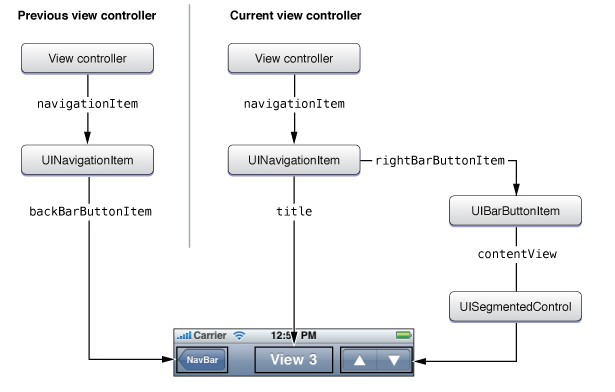

可以自定义的部分包括了三块，左边的“backBarButtonItem”/"leftBarButtonItem"。中间的title部分以及右边的“rightBarButtonItem”。

### 左边的返回键/自定义键
这三块地方中的左边有两种选择：要么是可以返回上级的“backBarButtonItem”，此时不要设置“leftBarButtonItem”否则会覆盖返回按钮。这里我们在回望下上面的图，会发现“backBarButtonItem”是属于上一个ViewController的，而其他两个是属于当前的ViewController。
这里初学者很容易混淆，比如我最开始就认为是在UINavigationController里面对这三个元素进行设置（ps:可恨的是它也有这三个属性，然后进行设置后总是不起效果），另一个比较容易出现的设置了子ViewController的backBarButtonItem，但是跳转后界面还是死活显示一个
“Back”。如果看了这个图我们就好理解了。在上面的例子中，我们为rootVC设置这个属性：

	rootVC.navigationItem.backBarButtonItem  = UIBarButtonItem()
    rootVC.navigationItem.backBarButtonItem?.title = "RootVC"
   
这样我们点击跳转的时候就可以看到对应的变化了。注意，这里我们没有设置其action,因为对于backBarButtonItem的action就一个作用，即使设置了也不起效果

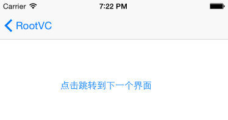

如果不想要返回作用，我们也可以将其设置成自定义的。并且可以通过action设置其自定义动作。比如我们看oschina的客户端，其左上角的按钮就定义成了个人中心 

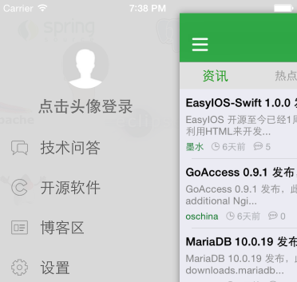

这里注意是子ViewController的leftBarButtonItem。比如我们定义rootVC的leftBarButtonItem设置为书签并给SecondVC设置为系统的播放按钮：

	rootVC.navigationItem.leftBarButtonItem = UIBarButtonItem(barButtonSystemItem: UIBarButtonSystemItem.Bookmarks, target: nil, action: Selector("NextSection"))
	...
	secnondVC.navigationItem.leftBarButtonItem  = UIBarButtonItem(barButtonSystemItem: UIBarButtonSystemItem.Play, target: nil, action: Selector("NextSection"))
	
这个时候我们会发现首页就出现了rootVC上的书签，因为他是当前ViewController。并且当点击跳转下一个界面时，我们发现，之前设置的rootVC的“backBarButtonItem”不见了，被secondVC的leftBarButtonItem覆盖了。这里我们可以看出leftBarButtonItem的优先级是要高的：
  
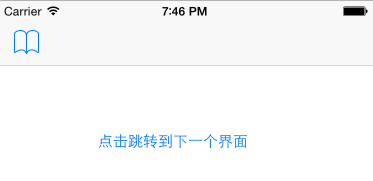 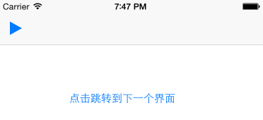

### 中间的Title
中间的部分最简单的就是如“信息”应用一样，设置一个标题。我们可以通过title属性进行设置：

	rootVC.navigationItem.title = "RootVC"
	
这样我们看到的首页就会变成 

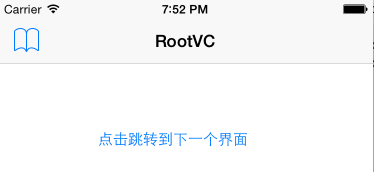

但是很多时候我们并不满足只设置一段文字，我们可能还想实现类似QQ那样的“段页面”，或者插入一个搜素框。

我们先来看怎么实现一个类似QQ的“段页面”

	let segmentedBar = UISegmentedControl(items: ["消息","电话"])
	rootVC.navigationItem.titleView = segmentedBar
	
这里主要是定制navigationItem.titleView,其接受一个UIView对象。这里可以看出来一个UIView给了我们充分的自定义空间。比如上面我们增加了一个“段页面”,效果如下：

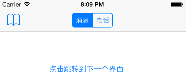

类似的，我们还可以插入一个搜索框:

	let searchBar = UISearchBar()
    searchBar.barStyle = UIBarStyle.BlackTranslucent
    rootVC.navigationItem.titleView = searchBar

这里我们看到效果图中的搜索栏一下吧后面的空间全给占掉了。

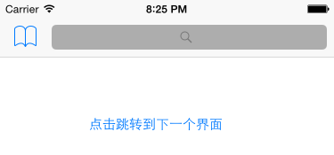

但是不要紧，既然是UIView，那么我们只要定义一个容器View，具体里面就随我们自由发挥了。

### 右边的自定义键
右边的自定义键实际上就是一个UIBarButtonItem。和上面的leftBarButtonItem一样，我们创建UIBarButtonItem即可。

## 五、状态回调

在ViewController之间互相切换的时候，我们也是可以进行一些状态控制的。其通过UINavigationControllerDelegate定义了这些事件变化的接口：

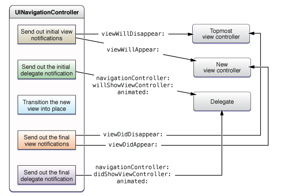

通过这个回调我们可以在ViewController消失和加载时加入一些自定义动作。
## 六、灵活使用界面的footer

在最上面介绍Navigation的时候，还有一个toolbar的结构。正常情况下这个toolbar是不现实的。当我们将UINavigationController的toolbarHidden属性置为“false”就可以看到在底部会有一个类似首部navigationItem的效果了。在Developer的文档中我们也可以找到
一副说明的图例：

这里我们添加一个搜索的toobaritem，看代码：

	// 首先打开rooVC的toolBar显示
    navVC?.toolbarHidden = false
    let  searchToolbar = UIBarButtonItem(barButtonSystemItem: UIBarButtonSystemItem.Search, target: nil, action: nil)
    rootVC.toolbarItems = [searchToolbar]
    
    // 对于 SecondVC 关闭toolBar显示
    navVC?.toolbarHidden = true
    
这样我们就看到了在首页里面就有一个搜索按钮，当点击到下一个界面就看不到下面的这个toolbar了：

 

这里在代码中我们首先创建一个UIBarButtonItem，然后将其放在数组中赋给rooVC的toolbarItems成员，从而实现对toolbar的自定义，这里数组中的元素会依次显示在toolbar当中。

这里注意了。和之前我们讨论的backBarButtonItem归属哪个ViewController时候一样，我们这里的toolbarItems是归属于当前的ViewController。因此这里我们要在首页显示，我们就设置RootVC的toolbarItems属性。另外这个toolBar最终还是UINavigationController的
。因此其是否显示还是要通过这里的额navVC来控制。

## 结语

通过Navigation我们可以构建一个基本的App框架，包括了界面之间的跳转，header/footer的设置以及动作的设置等。这里没有列举出所有的API以及切换的特效，也没有丰富的自定义。但是根据上面的逻辑框架，在结合自定义的动画和View，是很方便可以实现一个与众不同的但是又符合
这个框架结构的App的。