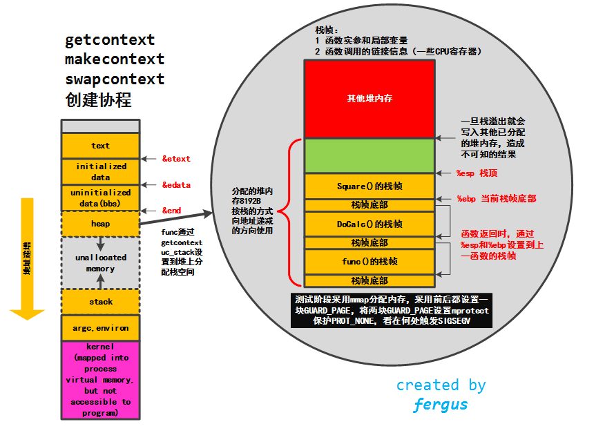

# Libtask使用的context

通过前面的[libtask实现的协程]()，我们可以看到Libtask主要是通过context接口（getcontext/setcontext/makecontext以及swapcontext）来实现上下文切换从而实现协程的。还有一些协程库用其他的机制实现了上下文的切换。比如用用setjmp+longjmp实现又或者switch...case这等神器实现的protothreads，甚至有汇编来实现的，比如这里的Libtask在某些平台下。

##一、ucontext接口
如果只看Linux（现在BAT的后台大量都是Linux）或者其他Unix-Like的时候，我们可以发现[Open Group](http://www.opengroup.org/)已经为我们定义了一套[ucontext](http://pubs.opengroup.org/onlinepubs/7990989799/xsh/ucontext.h.html)接口，并且非常好用，[云风](http://blog.codingnow.com/)大大的[coroutine](https://github.com/cloudwu/coroutine/)就是专注于Linux/FreeBSD上用这套接口实现的。

这套接口仅包含4个接口以及一个结构mcontext_t 。接口的头文件为“ <ucontext.h>”，这里我们以linux的man page7为例进行接口说明。

* ucontext_t 
该结构为每个平台抽象出一个包含必要上下文信息的context结构，比如典型的包含有：

    typedef struct ucontext {
       struct ucontext *uc_link;
       sigset_t         uc_sigmask;
       stack_t          uc_stack;
       mcontext_t       uc_mcontext;
       ...
    } ucontext_t;
    
具体对于里面的成员使用者这侧是不用关心的，可以认为他是一个对于不同平台透明的结构。

* int getcontext(ucontext_t *ucp)
将当前状态的上下文保存在ucp中，也就是获取context数据。

* int setcontext(const ucontext_t *ucp)
设置当前状态的上下文为ucp指向的内容，也就是设置context数据。联想到setjmp/longjmp就可以简单的理解这两个参数就可以实现一个上下文的切换动作。

* void makecontext(ucontext_t *ucp, void (*func)(), int argc, ...)
创建一个上下文。这个函数乍看上去好理解，按照字面意思很好理解。但是如果仔细推敲起来，何时调用呢？又怎么调用呢？为何要修改ucp里面的"ucp->uc_stack"和"ucp->uc_link"成员呢？

既然协程是用来改善线程的，我们不妨用从线程的角度去想一想。线程有一个"pthread_create"接口，用来设置一个线程的入口点，这里的makecontext也是一样，设置一个上下文的入口点，也就是这里的"ucp->uc_stack"。并且和"pthread_create"一样开始执行这里func指向的函数，该函数*接受argc个参数，并且每个参数都是整形* 。线程退出后可以用"pthread_join"获得退出状态和执行结果，而context的函数执行完后回到哪里呢？这个就要看"ucp->uc_link"该变量指定了一个新的context，函数结束后（除非用exit退出进程）便到这个上下下继续执行。

* int swapcontext(ucontext_t *oucp, const ucontext_t *ucp)
这个函数从字面意思就可以很容易的理解，将当前的上下文保存在oucp里面，然后跳转到ucp指定的位置进行执行。

##二、Libtask里面的context
Libtask抽象了一个结构：

    struct Context 
    {
    	ucontext_t	uc;
    };
    
来对所有的平台虚拟一个统一的context数据结构。这里ucontext_t和上面的介绍的不同点在于其是根据具体的平台来决定的，相当于根据平台特性对Open Group的ucontext的实现。在libtask的源码目录下可以看到：

    386-ucontext.h
    amd64-ucontext.h
    mips-ucontext.h
    power-ucontext.h
    // 以及
    asm.S
    
对于实现了ucontext的平台边使用其接口，否则话根据不同的CPU使用汇编实现了ucontext定义的接口。

##三、通过ucontext接口实现协程
通过Libtask对ucontext接口的使用，我们可以看到如何使用ucontext接口来实现协程中上下文的切换。

首先在创建Task（taskalloc）的时候通过getcontext获得当前任务的上下文环境：

	/* must initialize with current context */
	// 用当前的context来初始化新的协程
	if(getcontext(&t->context.uc) < 0){
		fprint(2, "getcontext: %r\n");
		abort();
	}
	
然后用makecontext设置协程的入口点。

    	t->context.uc.uc_stack.ss_sp = t->stk+8; // sp
    	t->context.uc.uc_stack.ss_size = t->stksize-64;
    	/*
    	 * All this magic is because you have to pass makecontext a
    	 * function that takes some number of word-sized variables,
    	 * and on 64-bit machines pointers are bigger than words.
    	 */
    //print("make %p\n", t);
    	z = (ulong)t;
    	y = z;
    	z >>= 16;	/* hide undefined 32-bit shift from 32-bit compilers */
    	x = z>>16;
    	makecontext(&t->context.uc, (void(*)())taskstart, 2, y, x); // 传递Task的地址
    	
这里可以看到，libtask并没有使用ucontext里面的返回点的设置，而是将Task的地址传递过去，然后取Task中存储的Handler进行执行，并在最后通过taskexit退出,这里的taskexit切换上下文到主循环中，从而开始下一次调度。

    static void taskstart(uint y, uint x)
    {
    	Task *t;
    	ulong z;
    
    	z = x<<16;	/* hide undefined 32-bit shift from 32-bit compilers */
    	z <<= 16;
    	z |= y;
    	t = (Task*)z; // 先寻址到Task
    
    //print("taskstart %p\n", t);
    	t->startfn(t->startarg); // 然后调用Task的handler
    //print("taskexits %p\n", t);
    	taskexit(0); // 接着就调用task的exit
    //print("not reacehd\n");
    }
    

在设置好协程的入口点后就可以选择在恰当进行跳转了。在libtask里面是通过"taskyield"最终调用到"swapcontext"中：

    void taskswitch(void)
    {
    	contextswitch(&taskrunning->context, &taskschedcontext);
    }
    
    static void contextswitch(Context *from, Context *to)
    {
    	if(swapcontext(&from->uc, &to->uc) < 0){
    		fprint(2, "swapcontext failed: %r\n");
    		assert(0);
    	}
    }
    
这里将当前状态保存在taskrunning中，然后切换到taskschedcontext上下文中，前面文章有介绍，这个是一个缓存，存放的是主循环for。跳转到那个位置后会取taskrunqueue上的新节点赋给taskrunning，从而继续新一次的调度过程。可见这里的taskrunning仅仅是占位作用。

##小结
这里ucontext是非常成熟的，只要看下相关的api便了解一切。可以借鉴的是
* libtask是如何在不同的平台上实现ucontext的，涵盖了mipas、arm等主流cpu平台
* libtask是如何设置协程进入点以及如何控制退出上下文的，通过taskexit切回到主循环进行下一次调度，避免上下文的恢复

这里最后再附一个网上大牛制作的内存结构图：
